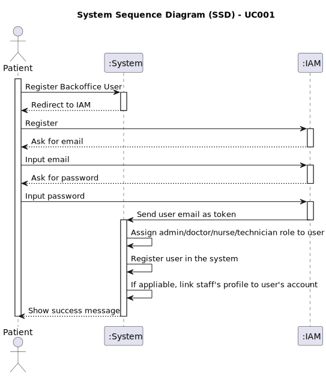

# UC001 - As Admin, I want to register new backoffice users (e.g., doctors, nurses, technicians, admins) via an out-of-band process, so that they can access the backoffice system with appropriate permissions

## 1. Requirements Engineering

### 1.1. Use Case Description

> As Admin, I want to register new backoffice users.

---

### 1.2. Customer Specifications and Clarifications

**From the specifications document:**

- Backoffice users divide themselves into two categories: admins and staff; staff is further divided into doctors, nurses, and technicians, all with a different set of permissions and feautures.
- Admins are responsible for managing the system and the staff.
- The account is only activated after the user sets their password.
- Strong password requirements are enforced.

**From the client clarifications:**

> **Question:** Can you please clarify if backoffice users registration uses the IAM system? And if the IAM system is the out-of-band process?
> **Answer:** What this means is that backoffice users can not self-register in the system like the patients do. The admin must register the backoffice user. If you are using an external IAM (e.g., Google, Azzure, Linkedin, ...) the backoffice user must first create their account in the IAM provider and then pass the credential info to the admin so that the user account in the system is "linked" with the external identity provider.
>
> **Question:** Can you clarify the username and email requirements?
> **Answer:** The username is the "official" email address of the user. For backoffice users, this is the mechanographic number of the collaborator, e.g., D240003 or N190345, and the DNS domain of the system. For instance, Doctor Manuela Fernandes has email "<D180023@myhospital.com>". The system must allow for an easy configuration of the DNS domain (e.g., environment variable).
For patients, the username is the email address provided in the patient record and used as identity in the external IAM. For instance, patient Carlos Silva has provided his email <csilva98@gmail.com> the first time he entered the hospital. That email address will be his username when he self-registers in the system.

---

### 1.3. Acceptance Criteria

> AC001.1: Backoffice users (e.g., doctors, nurses, technicians) are registered by an Admin via an internal
process, not via self-registration.
> AC001.2: Admin assigns roles (e.g., Doctor, Nurse, Technician) during the registration process.
> AC001.3: Registered users receive a one-time setup link via email to set their password and activate their
account.
> AC001.4: The system enforces strong password requirements for security.
> AC001.5: A confirmation email is sent to verify the user’s registration.

---

### 1.4. Found out Dependencies

- This Use Case is relative to US5.1.1, which is related to the backoffice management functionality.
- It relates to the following Use Case(s) as well:
  - [UC006 (US5.1.6)](../../UC006/README.md) - As a (non-authenticated) Backoffice User, I want to log in to the system using my credentials, so that I can access the backoffice features according to my assigned role.

### 1.5 Input and Output Data

**Input Data:**

- Typed data: username and email
- Selected data: user's role (i.e.: Admin, Doctor, Nurse, Technician)

**Output Data:**

- Email notification to the user with a one-time setup link to set their password and activate their account.

### 1.6. System Sequence Diagram (SSD)

### 1.7 Other Relevant Remarks

- An IAM system (OAuth) must be chosen and integrated with the system.
