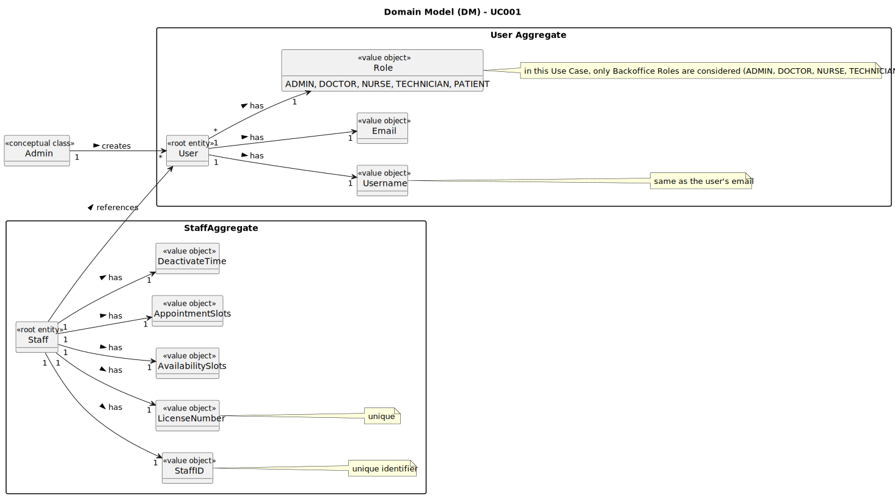

# UC001 - As Admin, I want to register new backoffice users (e.g., doctors, nurses, technicians, admins) via an out-of-band process, so that they can access the backoffice system with appropriate permissions

## 2. Analysis

### 2.1. Relevant Domain Model Excerpt

### 2.2. Process Specification

#### 2.2.1. Normal Flow

1. **Preconditions**: The Admin is logged in and has access to the backoffice management functionality.
2. **Select Option**: The Admin chooses to register a new backoffice user.
3. **Enter User Details**: The Admin enters the user's username/email (should match an existing staff profile's email) and selects the user's role (e.g., Doctor, Nurse, Technician, Admin).

#### 2.2.2. Exceptional Flows

- **EF001.1**: If the user is not unique, the system must notify the Admin and request a different username.
- **EF001.2**: If it doesn't exist a staff profile with the provided email, the system must notify the Admin and request a different email.

### 2.3. Functional Requirements Reevaluation

- **FR001.1**: The system shall allow the Admin to register new backoffice users.
- **FR001.2**: The system shall require the Admin to enter the user's username/email and select its role (Admin, Doctor, Nurse or Technician).
- **FR001.3**: The system shall validate the username to ensure uniqueness.
- **FR001.4**: The system shall validate the email to ensure it matches an existing staff profile's email.
_Note_: The requirement "The system shall notify candidates by email about the results of the verification process" will not be implemented since it will be used an external IAM.

### 2.4. Non-functional Requirements Specification

- **Functionality**: The system shall allow the Admin to add new users with the required details.
- **Usability**: The interface should be intuitive, guiding the Admin smoothly through the user creation process with clear instructions and error handling.
- **Reliability**: The system shall validate the username to ensure uniqueness and provide feedback on the success or failure of the user creation process.
- **Performance**: The user creation process should complete within acceptable time limits to maintain system responsiveness.
- **Supportability**: The system shall log the creation of new users for audit purposes and make them available immediately.

### 2.5. Data Integrity and Security

- Data integrity measures should ensure that users are accurately recorded and reflected in the system without compromising data consistency.
- Security measures should prevent unauthorized access to user creation functionality and protect sensitive userdata.
- The system should validate the username to ensure that it is unique and prevent duplicate entries.

### 2.6. Interface Design

- The interface shall be user-friendly, providing a clear workflow for creating new users with an input field for username/email and a dropdown for selecting the user's role.

### 2.7. Risk Analysis

- **R001.1**: Duplicate username
  - **Mitigation**: Implement a validation mechanism to check for duplicate usernames and notify the Admin to provide a unique name.
- **R001.2**: Database Error During user Creation
  - **Mitigation**: Implement error handling mechanisms to log the error and notify the Admin of the issue.
- **R001.3**: Unauthorized Access to user Creation
  - **Mitigation**: Implement secure access control mechanisms to restrict user
 creation to authorized Admin users.s

### 2.8. Decisions

- **D001.1**: Use a validation mechanism to ensure the uniqueness of usernames during creation.
- **D001.2**: Implement error handling to log and notify the Admin of any issues during user creation.
- **D001.3**: Utilize secure access control mechanisms (with the help of the IAM) to prevent unauthorized access to user creation functionality.
- **D001.4**: Log the creation of new users for audit purposes and immediate availability for scheduling.
