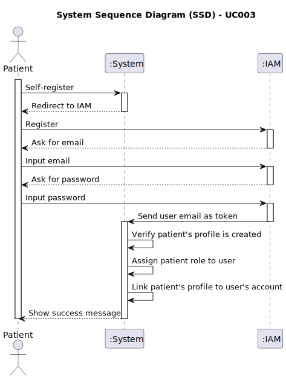

# UC003 - As a Patient, I want to register for the healthcare application, so that I can create a user profile and book appointments online

## 1. Requirements Engineering

### 1.1. Use Case Description

> As Patient, I want to self-register in the system.

---

### 1.2. Customer Specifications and Clarifications

**From the specifications document:**

- Patients should provide email and phone number.
- Only patients with an already existing record in the hospital can register to access the system.
- Patients should be able to book appointments.
- Patients should be able to edit their profile.

**From the client clarifications:**

> **Question:** Can the same user have both a patient and a healthcare profile?
> **Answer:** No.
>
> **Question:** If a patient registers themselves but an admin already created a profile for them, does it get assigned based on the email or how does it work?
> **Answer:** Yes. So the overall flow is the following: an administrator must first create the patient record so you cannot self-register and say "I am a patient". You will already have your patient record created. What you can do afterwards is create your online profile, so that you can afterwards access the system to check your appointments. But you first need to be known in the system. So, basically, this will have a two-factor authentication.
>
> **Question:** Do we always need to create an associated user when recording a patient profile in a medical facility?
> **Answer:** No. A patient profile can be created without an associated user unless it's easier technically to create an inactive user.
>
> **Question:** Can patients update both their user and patient profile information?
> **Answer:** Patients can update contact information but not medical details. Changes must be verified and validated.
>
> **Question:** In order for a patient to register himself in the IAM (assuming an external IAM is being used), is it necessary to already exist a patient profile (with name, email, medical record number, ...) in the system? If so, the patient profile will already be created, right? I'm asking this because of US5.1.3's description: "As a Patient, I want to register for the healthcare application, so that I can create a user profile and book appointments online". What info is already on the system when the patient registers himself and what info does he need to give after registering in the IAM?
> **Answer:** Generally speaking, the Admin will create the patient record and only afterwards the patient can self register. That action will link the patient record and the patient account profile. When registering, the patient will provide the email and phone number for the system to cross-check with the patient record.
>
> **Question:** In user story 5.1.3, there is an acceptance criterion that caused me some doubts: "The system validates the email address by sending a verification email with a confirmation link."

I understand the relevance of this acceptance criterion when not using an external IAM (Identity and Access Management) system. It ensures that users can't claim someone else's email address, as they would need to access the email to confirm their registration (for example, by clicking a unique link sent to the email).

However, there is another acceptance criterion stating: "Patients can self-register using the external IAM system." In this case, with an external IAM, wouldn't it be possible to bypass the step of sending a confirmation link to validate the email?

Would the following approach be considered correct?

An unauthenticated user tries to log in/access a patient area/register.
The unauthenticated user submits their credentials through the external IAM login (proving ownership of the email in the process).
The system receives this user's information (email), and if there is no corresponding user in the system, it asks for registration details (such as name and phone number).
The user submits the registration details, completing the registration as a patient in the system.
Advantages of this approach:

Improved user experience: It simplifies the registration process by reducing steps, making it quicker and more convenient for users.
Efficiency: By relying on the external IAM for email validation, you avoid duplicating validation mechanisms and streamline the process.
This approach ensures that the email belongs to the patient without the need to send a confirmation email. Do you think this is a good solution, even though it doesn't comply with one of the acceptance criteria?

### 1.3. Acceptance Criteria

> AC003.1: Patients can self-register using the external IAM system.
> AC003.2: During registration, patients provide personal details (e.g., name, email, phone) and create a profile.
> AC003.3: The system validates the email address by sending a verification email with a confirmation link.
> AC003.4: Patients cannot list their appointments without completing the registration process.

_Note_: AC003.3 is not applicable if an external IAM system is used.

### 1.4. Found out Dependencies

- This Use Case is relative to US5.1.3, which is related to the patient management functionality.
- It relates to the following Use Case(s) as well:
  - [UC006 (US5.1.7)](../../UC007/README.md) - As a Patient, I want to log in to the healthcare system using my external IAM credentials, so that I can access my appointments, medical records, and other features securely.

### 1.5 Input and Output Data

**Input Data:**

- Typed data:
  - Username/Email
  - Password (IAM)
  - Phone number
- Selected data: N/A

**Output Data:**

- (In)sucess message

### 1.6. System Sequence Diagram (SSD)

### 1.7 Other Relevant Remarks

- An IAM system must be chosen and integrated with the system.
