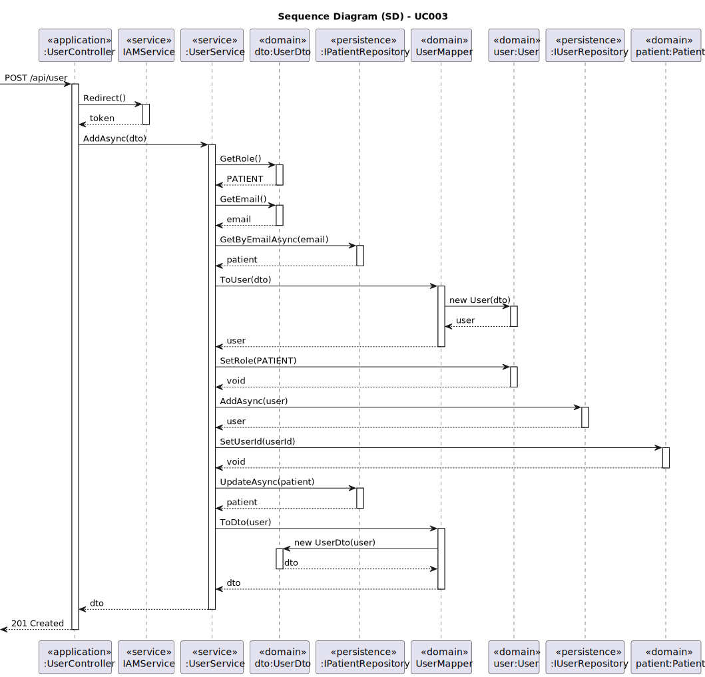
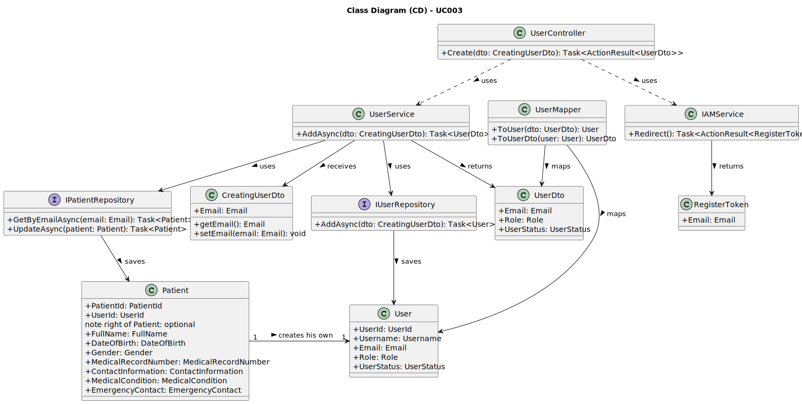

# UC003 - As a Patient, I want to register for the healthcare application, so that I can create a user profile and book appointments online

## 3. Design - Use Case Realization

### 3.1. Rationale

| Interaction ID                    | Question: Which class is responsible for...                 | Answer          | Justification (with patterns)                                                                                                        |
|:-----------------------------------|:------------------------------------------------------------|:----------------|:-------------------------------------------------------------------------------------------------------------------------------------|
| Step 1: Validate Email             | ... validating the uniqueness of the input email?            | UserService     | Service: UserService receives the input email from the patient and checks the repository to ensure it is unique.                     |
| Step 2: Create User                | ... creating and storing the user data?                      | UserService     | Service: UserService manages the process of user creation and interaction with the repository.                                       |
| Step 3: Store User                 | ... saving the new user to the database?                     | UserRepository  | Information Expert: UserRepository is responsible for storing and retrieving user data from the database.                            |
| Step 4: Assign Role                | ... assigning the patient role to the new user?              | UserService     | Service: UserService automatically assigns the "Patient" role to the user upon registration.                                         |
| Step 5: Register with IAM Service  | ... registering the user with the third-party IAM system?    | IAMService      | Service: IAMService handles user registration with the external Identity and Access Management (IAM) service for authentication.     |

### Systematization

According to the rationale above, the conceptual classes promoted to software classes are:

* User
* Email
* Role
* UserStatus

Other software classes (i.e. Pure Fabrication) identified:

* UserService
* UserRepository
* IAMService
* UserController

## 3.2. Sequence Diagram (SD)

## 3.3. Class Diagram (CD)

