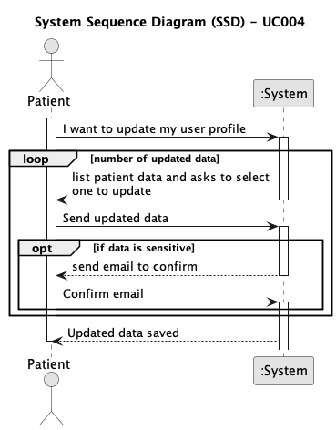

# UC004 -As a Patient, I want to update my user profile, so that I can change my personal details and preferences.

## 1. Requirements Engineering

### 1.1. Use Case Description

> As a Patient, I want to update my user profile, so that I can change my personal details and preferences.

---

### 1.2. Customer Specifications and Clarifications

**From the client clarifications:**

> **Question:** Can patients update both their user and patient profile information?
> 
> **Answer:** Patients can update contact information but not medical details. Changes must be verified and validated.

> **Question:** In the context of US 5.1.9, second acceptance criteria "Changes to sensitive data (e.g., contact information) trigger an email notification to the patient.", what classifies as "sensitive data".
>  
> **Answer:** This is part of the team's responsibilities in the scope of GDPR and the privacy policy you will define

> **Question:** In US 5.1.4., what do preferences mean in the patient profile?
> 
> **Answer:** preferences are for now related to marketing consent or not by the patient, or other related GDPR preferences

---

### 1.3. Acceptance Criteria

- **AC01:** Patients can log in and update their profile details (e.g., name, contact information, preferences).
- **AC02:** Changes to sensitive data, such as email, trigger an additional verification step (e.g., confirmation email).
- **AC03:** All profile updates are securely stored in the system.
- **AC04:** The system logs all changes made to the patient's profile for audit purposes.
---

### 1.4. Found out Dependencies

* This Use Case is relative to US 1010, which is related to the backoffice job opening management functionality.
* It relates to the following Use Cases as well:
  - There are no found dependencies

### 1.5 Input and Output Data

**Input Data:**
- information I want to update

**Output Data:**
- email of confirmation

### 1.6. System Sequence Diagram (SSD)

