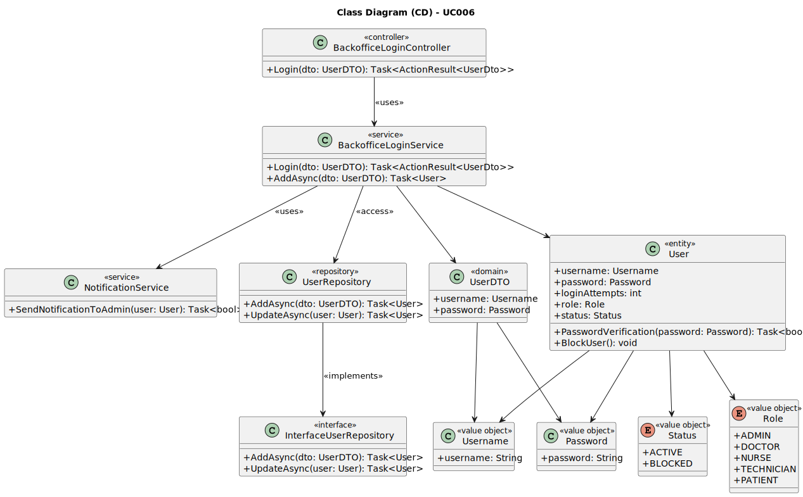

# UC006 - As a Backoffice User, I want to log in to the system using my credentials

## 3. Design - Use Case Realization

### 3.1. Rationale

| Interaction ID                                       | Question: Which class is responsible for...         | Answer                              | Justification (with patterns)                                                                                                       |
|:-----------------------------------------------------|:----------------------------------------------------|:------------------------------------|:------------------------------------------------------------------------------------------------------------------------------------|
| Step 1: User Login                                   | ... receiving and processing the login request?     | BackofficeLoginController           | Controller: BackofficeLoginController is responsible for handling login requests from backoffice users.                              |
|                                                      | ... validating the user’s credentials?              | BackofficeLoginService              | Service: BackofficeLoginService validates the user’s credentials using the provided username and password.                          |
|                                                      | ... representing the user in the system?            | UserDTO                             | Data Transfer Object (DTO): UserDTO represents user data transferred between layers.                                                 |
| Step 2: Password Verification                        | ... verifying the user's password?                  | User                                | Domain: User represents the user entity, responsible for managing user information and password validation.                          |
| Step 3: Role-Based Access Control                    | ... checking the user's role?                       | BackofficeLoginService              | Service: BackofficeLoginService checks the user's role to ensure appropriate access to features.                                     |
| Step 4: Blocking User after Failed Attempts          | ... blocking the user after failed login attempts?   | User, UserRepository                | Information Expert: User and UserRepository handle failed login attempt counting and blocking users when necessary.                  |
| Step 5: Sending Notification to Admin                | ... sending notifications to admins?                | NotificationService                 | Service: NotificationService is responsible for notifying the admin after five failed login attempts.                                |
| Step 6: Updating User Information                    | ... updating the user information (e.g., login attempts, status)? | UserRepository           | Repository: UserRepository is responsible for updating and persisting user data.                                                     |
| Step 7: Returning the login response                 | ... sending the success or failure response?        | BackofficeLoginController           | Controller: BackofficeLoginController returns the appropriate response based on the outcome of the login process.                   |

### Systematization ##

According to the taken rationale, the conceptual classes promoted to software classes are:

* User
* UserDTO
* Role

Other software classes (i.e., Pure Fabrication) identified:

* BackofficeLoginController
* BackofficeLoginService
* UserRepository
* NotificationService

## 3.2. Sequence Diagram (SD) - Invalid Credentials

## 3.2. Sequence Diagram (SD)

### 3.2.1 Valid Credentials

### 3.2.2 Invalid Credentials

## 3.3. Class Diagram (CD)

