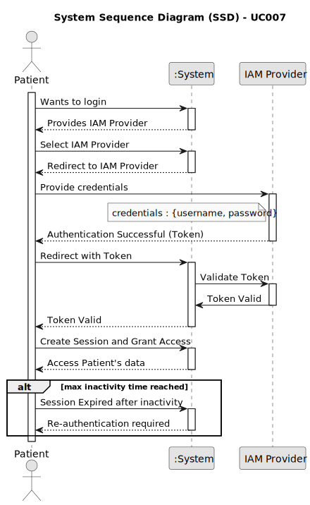

# UC007 - As a Patient, I want to log in to the healthcare system using my external IAM credentials, so that I can access my appointments, medical records, and other features securely.

## 1. Requirements Engineering

### 1.1. Use Case Description

> As a Patient, I want to log in to the healthcare system using my external IAM credentials, so that I can access my appointments, medical records, and other features securely.

---

### 1.2. Customer Specifications and Clarifications

**From the specifications document:**

- The solution should be deployed using an IAM to ensure the secure authentication and authorization of the user.

**From the client clarifications:**

n/a

> **Question:** -
> 
> **Answer:** -

---

### 1.3. Acceptance Criteria

> AC007.1: Patients log in via an external Identity and Access Management (IAM) provider (e.g., Google, Facebook, or hospital SSO).
> AC007.2: After successful authentication via the IAM, patients are redirected to the healthcare system with a valid session.
> AC007.3: Patients have access to their appointment history, medical records, and other features relevant to their profile.
> AC007.4: Sessions expire after a defined period of inactivity, requiring reauthentication.

---

### 1.4. Found out Dependencies

* This Use Case is relative to US 5.1.7, which is related to patient login functionality.
* It relates to the following Use Cases as well:
  n/a

### 1.5 Input and Output Data

**Input Data:**

- Typed data:
	- username
  - password

**Output Data:**
- token

### 1.6. System Sequence Diagram (SSD)

### 1.7 Other Relevant Remarks

n/a