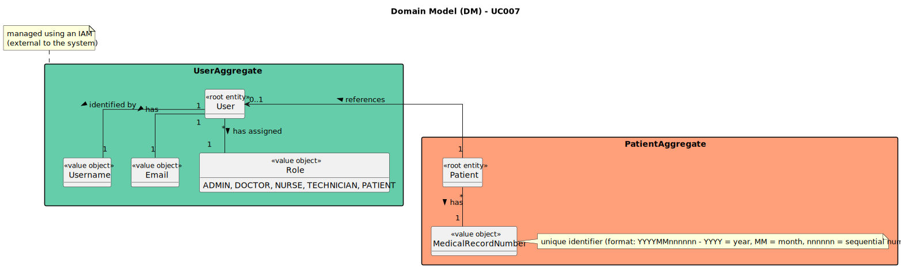

# UC007 - As Patient, I want to log in to the healthcare system using my external IAM credentials

## 2. Analysis
### 2.1. Relevant Domain Model Excerpt

### 2.2. Process Specification

#### 2.2.1. Normal Flow
1. **Authenticate Patient**: The system verifies that the patient is logged in with valid IAM credentials.
2. **Redirect to IAM Provider**: The system redirects the patient to the external IAM provider (Google, Facebook, hospital SSO).
3. **Provide Credentials**: The patient provides IAM credentials (username, password) to the IAM provider.
4. **IAM Authentication**: The IAM provider authenticates the patient and returns a token to the healthcare system.
5. **Token Validation**: The healthcare system validates the token with the IAM provider.
6. **Create Session**: The system creates a session for the patient, enabling access to appointments and medical records.
7. **Access Features**: The patient accesses appointments, medical records, and other features securely.
8. **Session Expiry**: After a period of inactivity, the session expires, and the patient must reauthenticate.

#### 2.2.2. Exceptional Flows
- **EF007.1**: If the IAM provider fails to authenticate the patient, an error message is displayed, and the login process is aborted.

### 2.3. Functional Requirements Reevaluation
- **FR007.1**: The system shall authenticate patients using external IAM providers.
- **FR007.2**: The system shall validate IAM tokens before granting access to patient data.
- **FR007.3**: The system shall terminate sessions after a predefined period of inactivity.

### 2.4. Non-functional Requirements Specification
- **Security**: Implement access control mechanisms to ensure that only authenticated patients can access the system.
- **Performance**: The token validation process should complete within acceptable time limits to ensure system responsiveness.
- **Usability**: The interface should guide the patient through the IAM login process with clear instructions and feedback.

### 2.5. Data Integrity and Security
- Data integrity measures should ensure that only valid IAM tokens are accepted, and patient data is securely transmitted and accessed.
- Security measures should prevent unauthorized access to sensitive patient information.

### 2.6. Interface Design
- The login interface will follow the EAPLI framework's design patterns, providing a user-friendly experience.
- The interface will clearly indicate success or failure of the authentication process.

### 2.7. Risk Analysis
- **R007.1**: System Error During Token Validation
    - **Mitigation**: Implement error handling mechanisms that notify patients if the token validation process fails.
- **R007.2**: Unauthorized Access
    - **Mitigation**: Implement encryption standards for IAM token transmission and storage.

### 2.8. Decisions
- **D007.1**: Use AZURE IAM provider for Patient authentication.
- **D007.2**: Use a session management system to handle patient access after successful authentication.
- **D007.3**: Implement a logging mechanism to track login attempts and session expiries.