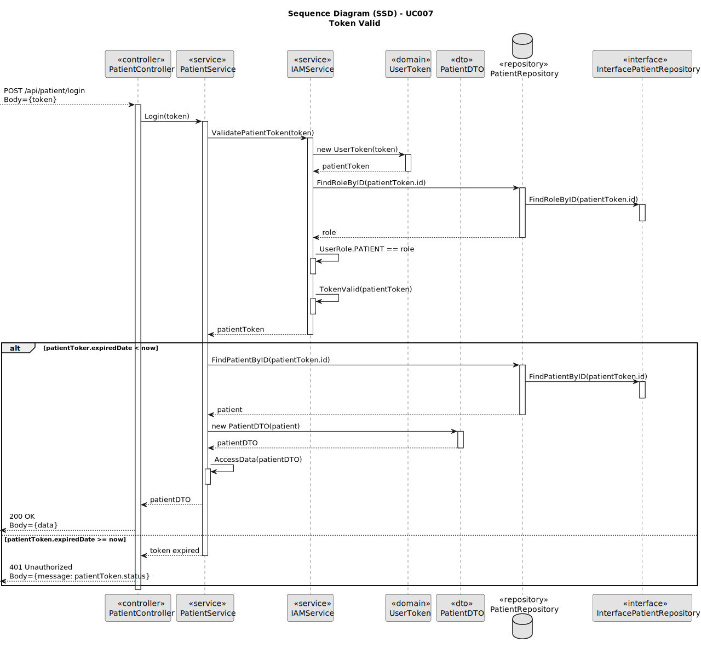
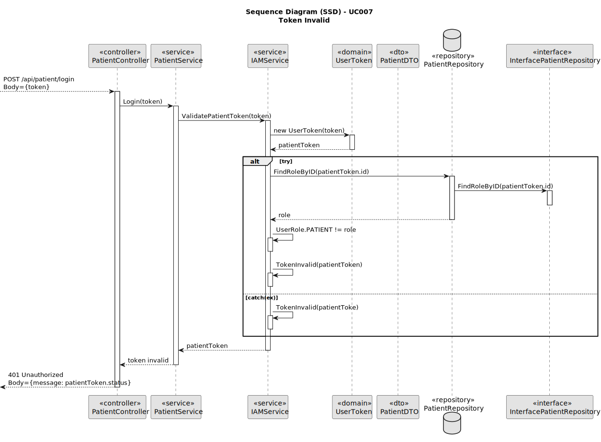
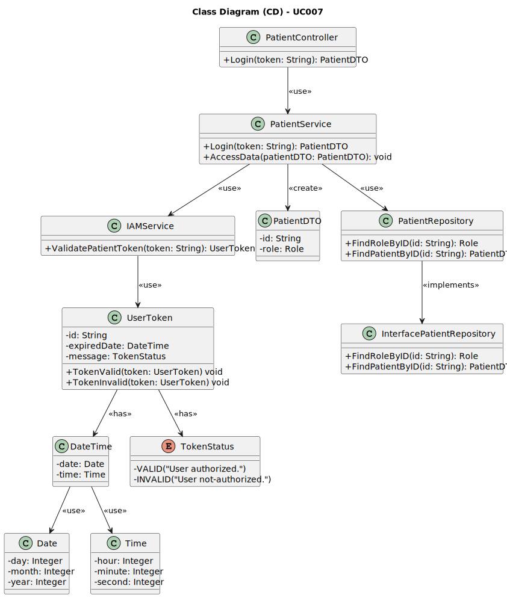

# UC007 - As a Patient, I want to log in to the healthcare system using my external IAM credentials

## 3. Design - Use Case Realization

### 3.1. Rationale

| Interaction ID                                       | Question: Which class is responsible for...               | Answer                              | Justification (with patterns)                                                                                                      |
|:-----------------------------------------------------|:----------------------------------------------------------|:------------------------------------|:-----------------------------------------------------------------------------------------------------------------------------------|
| Step 1: Login                                        | ... triggering the login process?                         | PatientController                   | Controller: PatientController is responsible for controlling the flow of the login process.                                        |
|                                                      | ... validating the external IAM token?                    | IAMService                          | Service: IAMService is responsible for validating the external IAM token.                                                          |
|                                                      | ... creating the user token from the IAM token?           | UserToken                           | Information Expert: UserToken is responsible for representing and holding token-related information.                              |
| Step 2: Fetch Patient Data                           | ... fetching the patient role?                            | PatientRepository                   | Information Expert: PatientRepository provides access to patient-related data, including their role.                               |
|                                                      | ... providing the patient data?                           | PatientDTO                          | Information Expert: PatientDTO is responsible for holding and transferring patient-related data.                                   |
| Step 3: Show Token Validation Result                 | ... showing the token validation result?                  | PatientController                   | Pure Fabrication: PatientController is responsible for sending the response (success or failure) of the login process.             |
| Step 4: Access Secure Data                           | ... accessing the patient's secure data (appointments, etc.)? | PatientService                    | Service: PatientService handles the secure access to patient data based on the validated session.                                  |

### Systematization

According to the taken rationale, the conceptual classes promoted to software classes are:

* PatientDTO
* UserToken
* DateTime

Other software classes (i.e. Pure Fabrication) identified:

* PatientController
* PatientService
* IAMService
* PatientRepository
* InterfacePatientRepository

## 3.2. Sequence Diagram (SD)

## 3.3. Class Diagram (CD)

