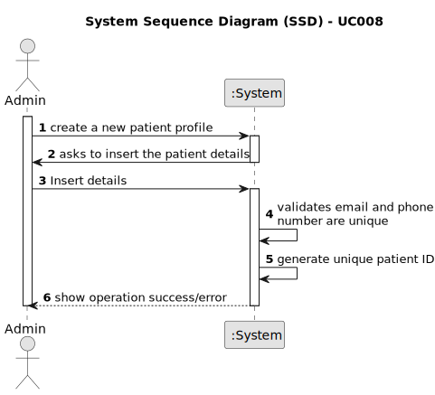

# UC008 - Create a new Patient profile

## 1. Requirements Engineering

### 1.1. Use Case Description

> As an Admin, I want to create a new patient profile, so that I can register their personal details and medical history.

---

### 1.2. Customer Specifications and Clarifications

**From the specifications document:**

//Preencher

**From the client clarifications:**

> **Question:** Is it mandatory for patients to have a user account to schedule a surgery?
> 
> **Answer:** No, patients are not required to have a user account. The system administrator creates patient profiles.

> **Question:** Can a user have both patient and healthcare staff profiles?
> 
> **Answer:** No, a user cannot have both profiles. Staff and patients have separate identifications.

> **Question:** How are duplicate patient profiles handled when registered by both the patient and admin?
> 
> **Answer:** The system checks the email for uniqueness. The admin must first create the patient record, and then the patient can register using the same email.

### 1.3. Acceptance Criteria

-**AC 1:** Admins can input patient details such as first name, last name, date of birth, contact information, and medical history.

-**AC 2:** A unique patient ID (Medical Record Number) is generated upon profile creation.

-**AC 3:** The system validates that the patient’s email and phone number are unique.

-**AC 4:** The profile is stored securely in the system, and access is governed by role-based permissions.

### 1.4. Found out Dependencies

* This Use Case is relative to US 5.1.8, which is related to the creation of a new patient profile, by an admin.
* It relates to the following Use Cases as well:
  - [UC04](../../UC004/README.md) - As a Patient, I want to update my user profile, so that I can change my personal details and preferences.
  - [UC05](../../UC005/README.md) - As a Patient, I want to delete my account and all associated data, so that I can
exercise my right to be forgotten as per GDPR.
  - [UC07](../../UC007/README.md) - As a Patient, I want to log in to the healthcare system using my external IAM credentials, so that I can access my appointments, medical records, and other features securely.
  - [UC09](../../UC009/README.md) - As an Admin, I want to edit an existing patient profile, so that I can update their information when needed.
  - [UC010](../../UC010/README.md) - As an Admin, I want to delete a patient profile, so that I can remove patients who are no longer under care.
  - [UC011](../../UC011/README.md) - As an Admin, I want to list/search patient profiles by different attributes, so that I can view the details, edit, and remove patient profiles.
  - [UC016](../../UC016/README.md) - As a Doctor, I want to request an operation, so that the Patient has access to the necessary healthcare.

### 1.5 Input and Output Data

**Input Data:**

- Automatic data:
	-  Medical Record Number (unique identifier)
- First Name
- Last Name
- Full Name
- Date of Birth
- Gender
- Contact Information (email, phone)
- Allergies/Medical Conditions (optional)
- Emergency Contact
- Appointment History (list of previous and upcoming appointments)

**Output Data:**
- Shows verification/erros message

### 1.6. System Sequence Diagram (SSD)

### 1.7 Other Relevant Remarks

