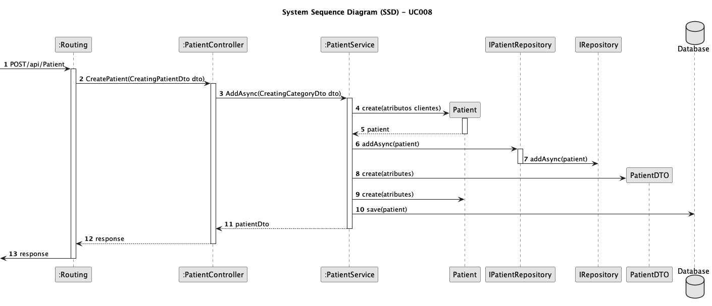
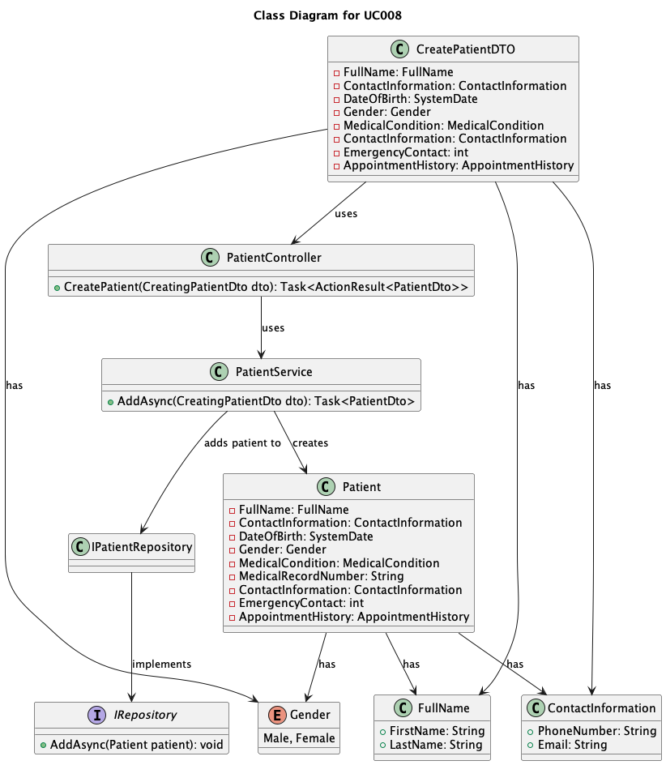

# UC008 - Create a new Patient profile

## 3. Design - Use Case Realization

### 3.1. Rationale

| Interaction ID                                | Question: Which class is responsible for...                | Answer                          | Justification (with patterns)                                                                                     |
|:----------------------------------------------|:-----------------------------------------------------------|:--------------------------------|:------------------------------------------------------------------------------------------------------------------|
| Step 1: Create Patient                        | ... triggering the patient creation process?                | CreatePatientController         | Controller: CreatePatientController is responsible for controlling the flow of the patient creation process.      |
|                                               | ... creating a new patient object?                          | Patient                         | Information Expert: Patient is responsible for holding and managing patient information.                          |
| Step 2: Persist Patient                       | ... persisting the patient object in the database?          | PatientRepository               | Information Expert: PatientRepository is responsible for saving patient data into the database.                   |
|                                               | ... interfacing with the repository for persistence?        | IPatientRepository              | Interface: IPatientRepository abstracts the details of the underlying database operations.                        |
| Step 3: Create PatientDTO                     | ... converting the patient object to a data transfer object (DTO)? | PatientDTO                      | Information Expert: PatientDTO holds data to be transferred across different system layers.                       |
| Step 4: Respond to API Request                | ... returning the response after patient creation?          | CreatePatientController         | Controller: CreatePatientController handles the response after processing the request.                            |

### Systematization

According to the rationale, the conceptual classes promoted to software classes are:

* Patient
* PatientDTO
* IPatientRepository
* PatientRepository

## 3.2. Sequence Diagram (SD)

## 3.3. Class Diagram (CD)

