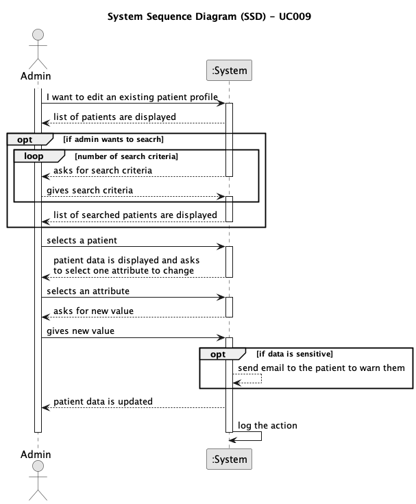

# UC009 - As an Admin, I want to edit an existing patient profile, so that I can update their information when needed.

## 1. Requirements Engineering

### 1.1. Use Case Description

> As an Admin, I want to edit an existing patient profile, so that I can update their information when needed.

---

### 1.2. Customer Specifications and Clarifications

**From the client clarifications:**

> **Question:** In this US an admin can edit a user profile. Does the system display a list of all users or the admin searchs by ID? Or both?
> 
> **Answer:** This requirement is for the editing of the user profile. from a usability point of view, the user should be able to start this feature either by searching for a specific user or listing all users and selecting one. Note that we are not doing the user interface of the system in this sprint.

> **Question:** Regarding the editing of patient information, is contact information the only sensitive data? Is it the only data that triggers an email notification?
> 
> **Answer:** faz parte das vossas responsabilidades no âmbito do módulo de proteçãod e dados e de acordo com a politica que venham a definir

---

### 1.3. Acceptance Criteria

- **AC01:** Admins can search for and select a patient profile to edit.
- **AC02:** Editable fields include name, contact information, medical history, and allergies.
- **AC03:**  Changes to sensitive data (e.g., contact information) trigger an email notification to the patient.
- **AC04:** The system logs all profile changes for auditing purposes.
---

### 1.4. Found out Dependencies

* This Use Case is relative to UC009, which is related to an Admin edits a patient profile
* It relates to the following Use Cases as well:
  - [UC011](../../UC011/README.md) - As an Admin, I want to list/search patient profiles by different attributes, so that I can view the details, edit, and remove patient profiles.

### 1.5 Input and Output Data

**Input Data:**

- search criteria
- selected patient
- selected attribute
- new value 

**Output Data:**
- Send email to warn the patient

### 1.6. System Sequence Diagram (SSD)

