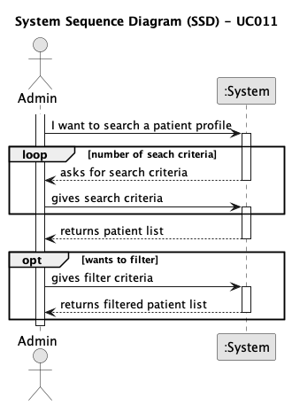

# UC011 - As an Admin, I want to list/search patient profiles by different attributes, so that I can view the details, edit, and remove patient profiles.

## 1. Requirements Engineering

### 1.1. Use Case Description

> As an Admin, I want to list/search patient profiles by different attributes, so that I can view the details, edit, and remove patient profiles.

---

### 1.2. Customer Specifications and Clarifications

**From the client clarifications:**

> **Question:** They can be searched by name, email, date of birth, or medical record number, but everyone has the same role, no specialization, and so on. Can you be a bit more detailed on the filters you're looking to be applied in the patients listings?
>  
> **Answer:** Users should be able to search students by: name, AND/OR email, AND/OR phone number, AND/OR medical record number, AND/OR date of birth, AND/OR gender,  listing of users should have the same filters available

---

### 1.3. Acceptance Criteria

- **AC1**: Admins can search patient profiles by various attributes, including name, email, date of birth, or medical record number.
- **AC2**: The system displays search results in a list view with key patient information (name, email, date of birth).
- **AC3**: Admins can select a profile from the list to view, edit, or delete the patient record.
- **AC4**: The search results are paginated, and filters are available to refine the search results.
---

### 1.4. Found out Dependencies

* This Use Case is relative to US 1010, which is related to the backoffice job opening management functionality.
* It relates to the following Use Cases as well:
  - [UC009](../../UC009/README.md) - As an Admin, I want to edit an existing patient profile, so that I can update their information when needed.
  - [UC010](../../UC010/README.md) - As an Admin, I want to delete a patient profile, so that I can remove patients who are no longer under care

### 1.5 Input and Output Data

**Input Data:**
- search criteria
- filters criteria

**Output Data:**
- List of patients

### 1.6. System Sequence Diagram (SSD)

