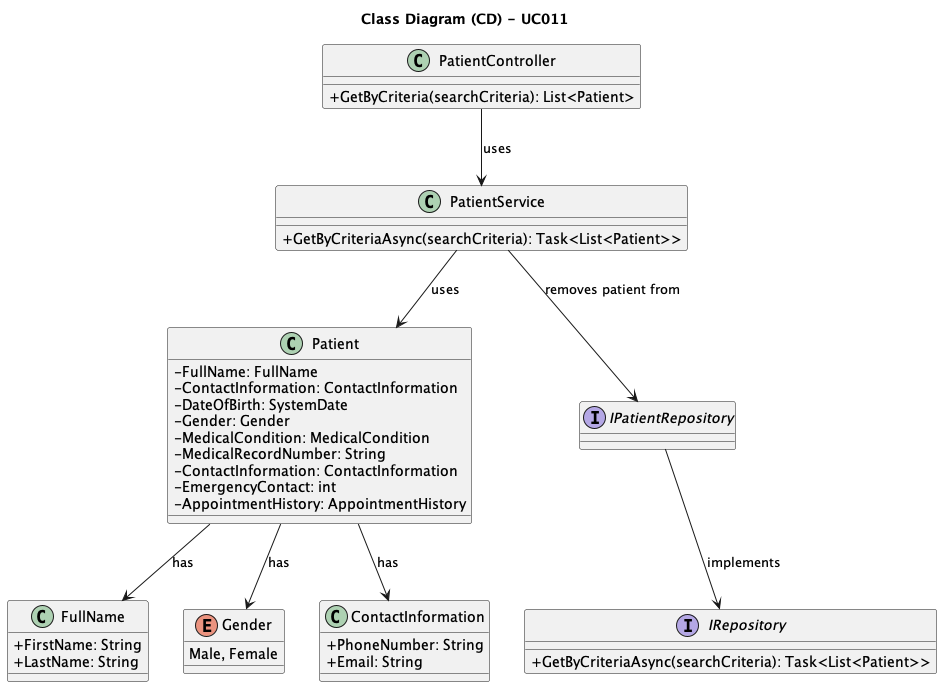

# UC011 - As an Admin, I want to list/search patient profiles by different attributes, so that I can view the details, edit, and remove patient profiles.

## 3. Design - Use Case Realization

### 3.1. Rationale
| Interaction ID                                | Question: Which class is responsible for...                | Answer                          | Justification (with patterns)                                                                                     |
|:----------------------------------------------|:-----------------------------------------------------------|:--------------------------------|:------------------------------------------------------------------------------------------------------------------|
| Step 1: Receive search request                | ... triggering the search process?                         | Routing                         | Controller: Routing is responsible for receiving the request from the client and initiating the process.           |
|                                               | ... passing the search criteria to the controller?          | Routing                         | Controller: Routing passes the search criteria to the appropriate controller.                                      |
| Step 2: Get matching patients                 | ... handling the business logic for retrieving patients?    | PatientService                  | Service: PatientService processes the search criteria and interacts with repositories to retrieve patients.        |
|                                               | ... fetching patients from the repository based on criteria?| IPatientRepository              | Information Expert: IPatientRepository is responsible for accessing the data related to patients.                 |
|                                               | ... querying the database for patient information?          | IRepository                     | Information Expert: IRepository interacts with the database to execute the search query based on the criteria.     |
| Step 3: Combine and filter results            | ... creating and managing the patient list?                | Patient                         | Information Expert: Patient holds and provides the list of patients to be filtered.                                |
|                                               | ... removing duplicate patients from the result list?       | PatientService                  | Service: PatientService ensures that the final list of patients is distinct and free of duplicates.                |
| Step 4: Return search results                 | ... returning the list of patients to the client?           | Routing                         | Controller: Routing sends the final list of matching patients back to the client.                                  |

### Systematization

According to the rationale, the conceptual classes promoted to software classes are:

* Patient
* IPatientRepository
* IRepository

Other software classes (i.e., Pure Fabrication) identified:

* Routing
* PatientService
## 3.2. Sequence Diagram (SD)

## 3.3. Class Diagram (CD)

