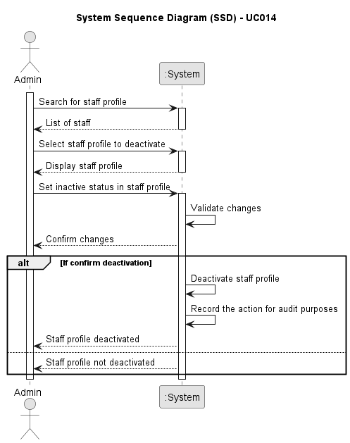

# UC014 - As an Admin, I want to deactivate a staff profile, so that I can remove them from the hospital’s active roster without losing their historical data

## 1. Requirements Engineering

### 1.1. Use Case Description

> An Admin user will be able to search for and select a staff profile to deactivate. Deactivating the staff profile should remove the staff member from the hospital’s active roster, while ensuring that their historical data, such as appointments they were involved in, remains accessible for audit purposes and record keeping.

---

### 1.2. Customer Specifications and Clarifications

**From the specifications document:**

- The staff profile must be deactivated without deleting any historical data.
- The deactivation should be recorded in the system to ensure compliance with GDPR and for audit purposes.

**From the client clarifications:**

> **Question:**
>
> **Answer:**

---

### 1.3. Acceptance Criteria

> AC014.1: Admins can search for and select a staff profile to deactivate.
> AC014.2: Deactivating a staff profile removes them from the active roster, but their historical data (e.g.,appointments) remains accessible.
> AC014.3: The system confirms deactivation and records the action for audit purposes.

---

### 1.4. Found out Dependencies

- This Use Case is relative to US 5.1.14, which is related to the desactive a staff profile made by Admin.
- It relates to the following Use Cases as well:
  - [UC012](../../UC012/README.md) - As an Admin, I want to create a new staff profile, so that I can add them to the hospital’s roster.

### 1.5 Input and Output Data

**Input Data:**

- Selected data:
  - Staff profile

**Output Data:**

- Confirmation of deactivation
- Deactivation record for audit purposes.

### 1.6. System Sequence Diagram (SSD)

### 1.7 Other Relevant Remarks

n/a
