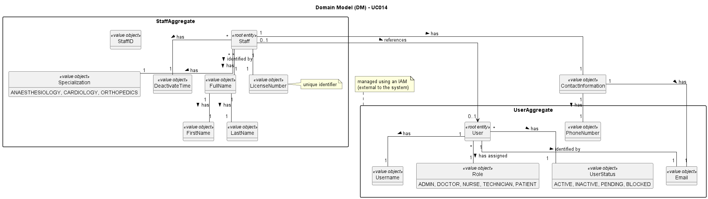

# UC014 - As an Admin, I want to deactivate a staff profile, so that I can remove them from the hospital’s active roster without losing their historical data

## 2. Analysis

### 2.1. Relevant Domain Model Excerpt

The relevant domain model includes aggregates such as Staff and User, featuring root entities like Staff and User, along with value objects like DeactivateTime, which is specifically created for this use case to record the action for audit purposes. These value objects are essential for deactivating a staff profile in the system.

### 2.2. Process Specification

#### 2.2.1. Normal Flow

1. **Authenticate Admin**: Verify that the Admin is logged in with appropriate permissions.
2. **Access Staff Management Interface**: Navigate to the staff management section of the backoffice.
3. **Select Staff Profile**: Choose the specific staff profile that needs to be deactivated.
4. **Deactivate Profile**: The Admin confirms the deactivation of the selected staff profile.
5. **Update Staff Roster**: The system removes the staff member from the active roster while retaining their historical data.
6. **Record Deactivation**: The system logs the deactivation action for audit purposes.
7. **Feedback**: The system provides feedback to the Admin regarding the success or failure of the deactivation process.

#### 2.2.2. Exceptional Flows

- **EF014.1**: If the deactivation fails, the system must notify the Admin and log the error.

### 2.3. Functional Requirements Reevaluation

- **FR014.1**: The system shall allow Admins to deactivate a staff profile.
- **FR014.2**: The system retains accessible historical data for deactivated staff profiles.
- **FR014.3**: The system shall record the deactivation action for audit purposes.
- **FR014.4**: The system shall provide feedback to the Admin on the success or failure of the deactivation process.

### 2.4. Non-functional Requirements Specification

- **Security**: Implement access control mechanisms to ensure that only authorized Admins can deactivate staff profiles.
- **Performance**: Ensure the deactivation process completes within acceptable time limits to maintain system responsiveness.
- **Usability**: The interface should be intuitive, guiding the Admin smoothly through the deactivation process with clear instructions and error handling.

### 2.5. Data Integrity and Security

- Data integrity measures should ensure that deactivation actions are accurately recorded and reflected in the system without compromising data consistency.
- Security measures should prevent unauthorized access to the deactivation functionality and protect sensitive staff data.

### 2.6. Interface Design

- The interface should provide an intuitive and efficient workflow for selecting staff profiles and deactivating them, with clear indications of success or failure.

### 2.7. Risk Analysis

- **R030.1**: System Error During Deactivation
  - **Mitigation**: Implement error handling mechanisms to notify the Admin of any system failures and provide guidance on how to proceed.
- **R014.2**: Unauthorized Access to the System
  - **Mitigation**: Use role-based access control to restrict profile creation to authorized Admins only.

### 2.8. Decisions

- **D014.1**: Use role-based access control to ensure that only authorized Admins can deactivate staff profiles.
- **D014.2**: Implement a logging mechanism to record the success or failure of staff profile deactivation for audit purposes. DeactivateTime has been created.
- **D014.3**: Use the provided domain model as a reference for implementing the deactivation functionality.
