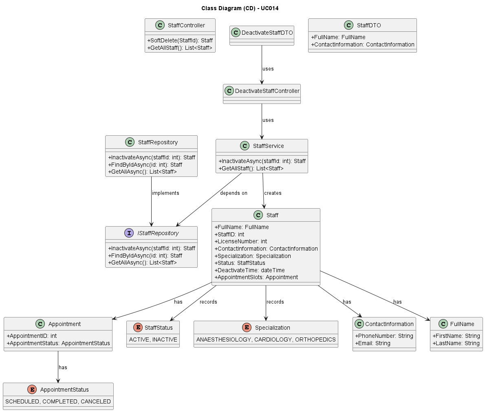

# UC014 - As an Admin, I want to deactivate a staff profile, so that I can remove them from the hospital’s active roster without losing their historical data

## 3. Design - Use Case Realization

### 3.1. Rationale

| Interaction ID                                      | Question: Which class is responsible for...         | Answer                    | Justification (with patterns)                                                                                |
|:----------------------------------------------------|:----------------------------------------------------|:--------------------------|:-------------------------------------------------------------------------------------------------------------|
| Step 1: Search for Staff Profile                    | ... triggering the deactivation process?            | DeactivateStaffController | Controller: DeactivateStaffController is responsible for controlling the flow of the deactivation process.   |
|                                                     | ... fetching information about the staff profile?   | Staff                     | Information Expert: Staff is responsible for holding and providing staff profile information.                |
|                                                     | ... accessing the list of staff members?            | StaffRepository           | Information Expert: StaffRepository provides access to staff data.                                           |
| Step 2: Update Status                               | ... updating the status of the staff profile?       | StaffService              | Service: StaffService is responsible for performing the update of the staff status (Active/Inactive).        |
|                                                     | ... recording the deactivation time?                | DeactivateTime            | Value Object: DeactivateTime stores the timestamp of the deactivation for audit purposes.                    |
| Step 3: Save Deactivation Record                    | ... saving the deactivation record in the database? | StaffRepository           | Information Expert: StaffRepository is responsible for saving the deactivation record in the database.       |
| Step 4: Show (in)success of the operation's message | ... showing the notification (in)success message?   |                           | Pure Fabrication: StaffProfileUI shows the success or failure message of the staff profile creation process. |

### Systematization ##

According to the taken rationale, the conceptual classes promoted to software classes are:

* Staff
* StaffStatus
* DeactivateTime
* Appointment
* AppointmentStatus
* Specialization
* ContactInformation
* FullName

Other software classes (i.e. Pure Fabrication) identified:

* DeactivateStaffController
* StaffRepository
* StaffService
* DeactivateStaffDTO
* IStaffRepository

## 3.2. Sequence Diagram (SD)

## 3.3. Class Diagram (CD)

