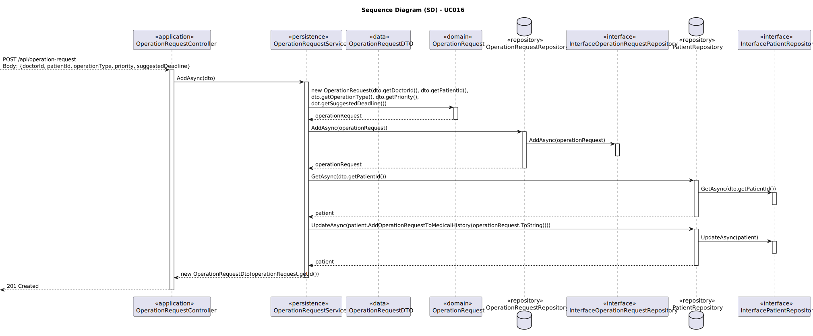
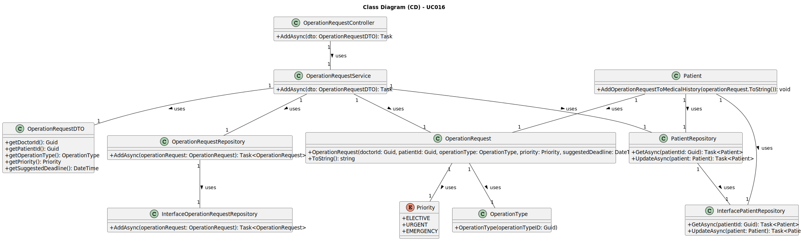

# UC016 - As a Doctor, I want to request an operation, so that the Patient has access to the necessary healthcare

## 3. Design - Use Case Realization

### 3.1. Rationale

| Interaction ID                                       | Question: Which class is responsible for...                  | Answer                               | Justification (with patterns)                                                                                                        |
|:-----------------------------------------------------|:-------------------------------------------------------------|:-------------------------------------|:-------------------------------------------------------------------------------------------------------------------------------------|
| Step 1: Receive Operation Request                    | ... receiving the operation request data?                     | OperationRequestController           | Controller: OperationRequestController is responsible for receiving and handling the operation request from the doctor.              |
|                                                      | ... validating the operation request data?                    | OperationRequestService              | Service: OperationRequestService is responsible for validating the operation request, ensuring the operation type matches specialization.|
|                                                      | ... creating the operation request entity?                    | OperationRequest                     | Domain: OperationRequest is the entity responsible for encapsulating the operation request details.                                   |
| Step 2: Persist Operation Request                    | ... persisting the operation request?                         | OperationRequestRepository           | Repository: OperationRequestRepository handles the saving of the operation request entity to the database.                            |
| Step 3: Retrieve Patient Information                 | ... retrieving the patient's medical record?                  | PatientRepository                    | Repository: PatientRepository is responsible for fetching the patient details from the database.                                      |
| Step 4: Update Patient's Medical History             | ... updating the patient’s medical history with the request?  | Patient                              | Domain: Patient holds the medical history and updates it with the new operation request.                                              |
|                                                      | ... saving the updated patient record?                        | PatientRepository                    | Repository: PatientRepository saves the updated patient data, including the new operation request.                                    |
| Step 5: Confirm Operation Request                    | ... confirming the successful submission?                     | OperationRequestController           | Controller: OperationRequestController sends the confirmation message to the doctor, indicating successful request creation.         |

### Systematization

According to the taken rationale, the conceptual classes promoted to software classes are:

- **OperationRequest**
- **Patient**
- **OperationType**
- **Priority**

Other software classes (i.e. Pure Fabrication) identified:

- **OperationRequestController**
- **OperationRequestService**
- **OperationRequestRepository**
- **PatientRepository**

## 3.2. Sequence Diagram (SD)

## 3.3. Class Diagram (CD)

