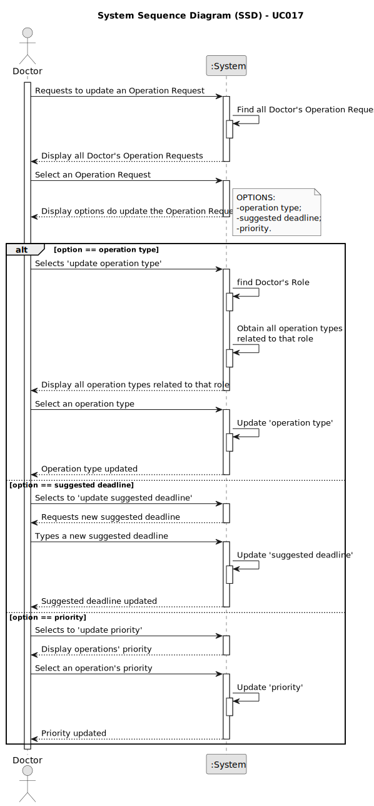

# UC017 - As a Doctor, I want to update an operation requisition, so that the Patient has access to the necessary healthcare

## 1. Requirements Engineering

### 1.1. Use Case Description

> As a Doctor, I want to update an operation requisition, so that the Patient has access to the necessary healthcare.

---

### 1.2. Customer Specifications and Clarifications

**From the specifications document:**

- As a Doctor, I want to update an operation requisition, so that the Patient has access to the necessary healthcare

**From the client clarifications:**

> **Question:** Hello Mr. Client, you want to log all updates to the operation request. Do you plan to have this info available in the app or is this just for audit purposes ?
> 
> **Answer:** the history of the operation type definition is part of the application's data. if the user needs to view the details of an operation that was performed last year, they need to be able to see the operation configuration that was in place at that time

---

### 1.3. Acceptance Criteria

> AC017.1: Doctors can update operation requests they created (e.g., change the deadline or priority).
> AC017.2: The system checks that only the requesting doctor can update the operation request.
> AC017.3: The system logs all updates to the operation request (e.g., changes to priority or deadline).
> AC017.4: Updated requests are reflected immediately in the system and notify the Planning Module of any changes.

---

### 1.4. Found out Dependencies

* This Use Case is relative to US 5.1.17, which is related to the operation request management functionality.
* It relates to the following Use Cases as well:
  - [UC016](../../UC016/README.md) - As a Doctor, I want to request an operation, so that the Patient has access to the necessary healthcare.
  - [UC018](../../UC018/READEME.md) - As a Doctor, I want to remove an operation requisition, so that the healthcare activities are provided as necessary.
  - [UC019](../../UC019/README.md) -  As a Doctor, I want to list/search operation requisitions, so that I see the details, edit, and remove operation requisitions.

### 1.5 Input and Output Data

**Input Data:**

- Automatic data:
	- Doctor's Role

- Selected data:
  - update option {'operation type', 'suggested deadline', 'priority'}
  - operation type
  - priority

- Typed data:
  - suggested dealine

**Output Data:**
- Confirmation message.

### 1.6. System Sequence Diagram (SSD)

### 1.7 Other Relevant Remarks
n/a