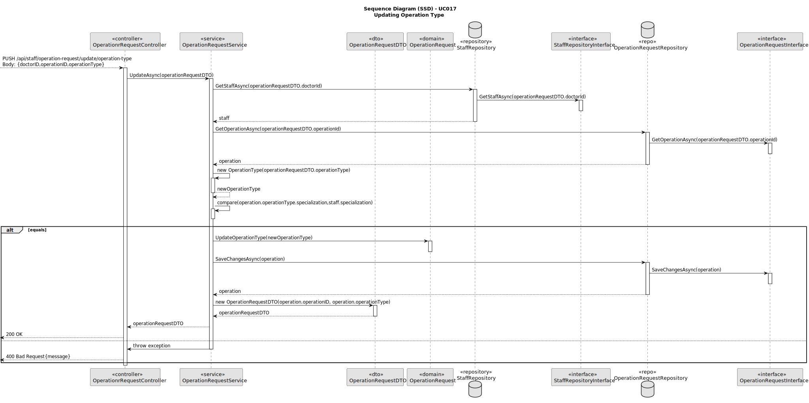
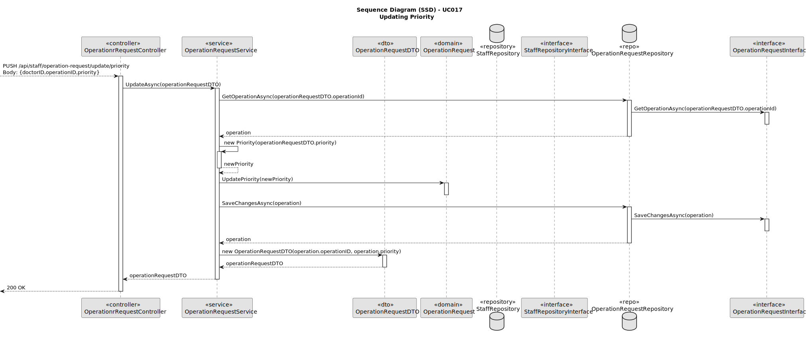
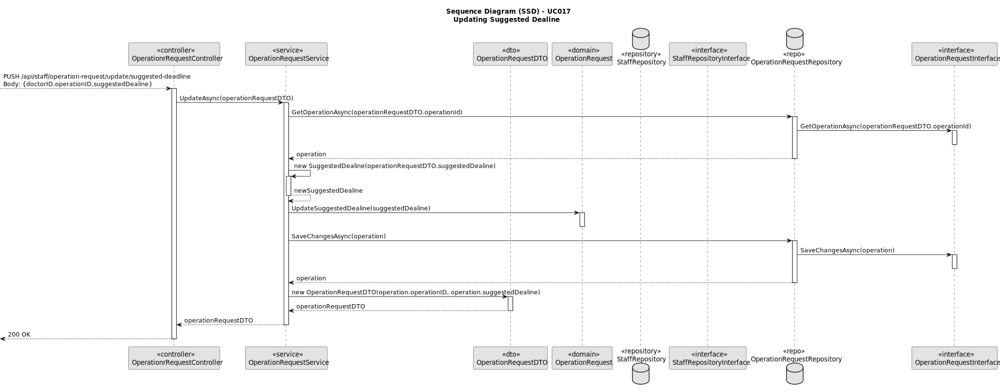
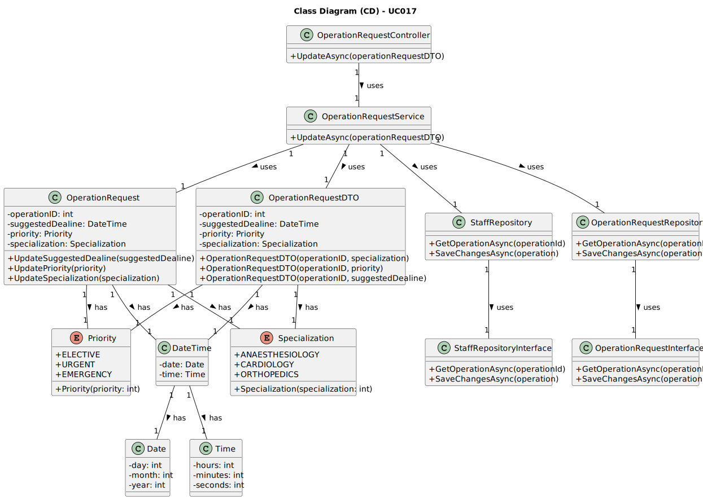

# UC017 - As Doctor, I want to update an operation requisition, so that the Patient has access to the necessary healthcare

## 3. Design - Use Case Realization

### 3.1. Rationale

| Interaction ID                                       | Question: Which class is responsible for...         | Answer                              | Justification (with patterns)                                                                                                        |
|:-----------------------------------------------------|:----------------------------------------------------|:------------------------------------|:-------------------------------------------------------------------------------------------------------------------------------------|
| Step 1: Update Operation Type                        | ... triggering the operation update?                | OperationRequestController          | Controller: OperationRequestController controls the flow of the operation requisition update process.                                |
|                                                      | ... fetching doctor information?                    | StaffRepository                     | Information Expert: StaffRepository provides access to doctor data for validation.                                                   |
|                                                      | ... fetching the operation request?                 | OperationRequestRepository          | Information Expert: OperationRequestRepository provides access to the operation request data.                                        |
| Step 2: Update Fields                                | ... creating the updated fields (e.g., type)?       | OperationRequestService             | Service: OperationRequestService handles the logic for creating the updated fields in the operation request.                         |
|                                                      | ... comparing specializations for validation?       | OperationRequestService             | Service: The service compares doctor and operation specializations before updating the operation type.                               |
| Step 3: Save Operation Request                       | ... saving the updated operation request?           | OperationRequestRepository          | Information Expert: OperationRequestRepository saves the updated operation request in the database.                                  |
| Step 4: Show (in)success of the operation's message  | ... showing the operation update (in)success message?| OperationRequestUI                  | Pure Fabrication: OperationRequestUI is responsible for showing the success or failure message of the operation update process.       |

### Systematization ##

According to the rationale, the conceptual classes promoted to software classes are:

* OperationRequest
* Staff
* Specialization

Other software classes (i.e. Pure Fabrication) identified:

* OperationRequestController
* OperationRequestService
* OperationRequestRepository
* OperationRequestUI

## 3.2. Sequence Diagram (SD)

## 3.3. Class Diagram (CD)

