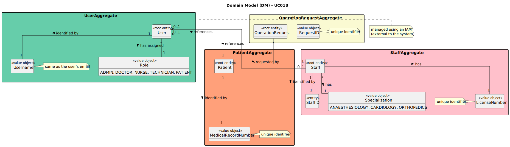

# UC018 - As Doctor, I want to remove an operation requisition, so that healthcare activities are provided as necessary

## 2. Analysis

### 2.1. Relevant Domain Model Excerpt

The following diagram illustrates the domain model for this use case.

### 2.2. Process Specification

#### 2.2.1. Normal Flow
1. **Authenticate Doctor**: The doctor logs in with appropriate permissions.
2. **Access Operation Request Management Interface**: The doctor navigates to the operation requisition management section.
3. **View Operation Requests**: The system displays the list of operation requests created by the doctor that have not been scheduled.
4. **Select Operation Request**: The doctor selects an operation request to delete.
5. **Confirm Deletion**: The system prompts the doctor to confirm the deletion.
6. **Delete Operation Request**: The system deletes the selected operation request, removing it from the patient’s medical record.
7. **Notify Planning Module**: The system notifies the Planning Module and updates any affected schedules.
8. **Feedback**: The system confirms the deletion to the doctor.

#### 2.2.2. Exceptional Flows
- **EF018.1**: If the operation has already been scheduled, the system does not allow the deletion and notifies the doctor that the request cannot be deleted.
- **EF018.2**: If there is a system error during deletion, the system notifies the doctor and logs the error.

### 2.3. Functional Requirements Reevaluation
- **FR018.1**: The system shall allow doctors to delete operation requests they created if the operation has not yet been scheduled.
- **FR018.2**: The system shall display a confirmation prompt before deletion.
- **FR018.3**: Once deleted, the operation request shall be removed from the patient’s medical record and cannot be recovered.
- **FR018.4**: The system shall notify the Planning Module and update any schedules affected by the deletion.
- **FR018.5**: The system shall provide feedback to the doctor on the success or failure of the deletion operation.

### 2.4. Non-functional Requirements Specification
- **Security**: The system must ensure that only authorized doctors can delete operation requests they created.
- **Performance**: The system must perform the deletion and notify the Planning Module within a reasonable time frame to maintain system responsiveness.
- **Usability**: The interface should be user-friendly, providing a smooth workflow for viewing and deleting operation requests with clear confirmation and error handling mechanisms.

### 2.5. Data Integrity and Security
- Data integrity measures should ensure that once an operation request is deleted, it is fully removed from the patient’s medical record without any residual data.
- Security measures should prevent unauthorized access to the operation request deletion functionality and protect patient data.

### 2.6. Interface Design
- The interface will follow established design patterns, providing a user-friendly experience for doctors managing operation requisitions.
- The interface should guide the doctor smoothly through the process of selecting and deleting operation requests, with clear instructions and feedback on the success or failure of the operation.

### 2.7. Risk Analysis
- **R018.1**: System Error During Deletion
    - **Mitigation**: Implement robust error handling mechanisms to notify the doctor of any failures and log errors for further investigation.
- **R018.2**: Unauthorized Deletion of Operation Requests
    - **Mitigation**: Implement access control mechanisms to ensure that only the doctor who created the operation request can delete it.

### 2.8. Decisions
- **D018.1**: Use role-based access control to restrict operation request deletion functionality to the doctor who created the request.
- **D018.2**: Notify the Planning Module immediately after deletion to ensure that any schedules affected by the request are updated in real-time.
- **D018.3**: Ensure that once an operation request is deleted, it cannot be recovered, maintaining strict data integrity.

