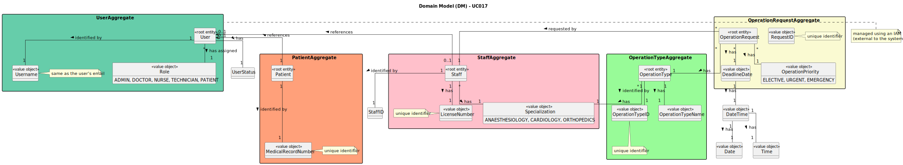

# UC019 - As a Doctor, I want to list/search operation requisitions, so that I see the details, edit, and remove operation requisitions

## 2. Analysis

### 2.1. Relevant Domain Model Excerpt

The following diagram was created based on the provided domain model for managing operation requisitions.

### 2.2. Process Specification

#### 2.2.1. Normal Flow
1. **Authenticate Doctor**: The system verifies that the doctor is logged in with appropriate permissions.
2. **Access Operation Requisition List**: The doctor accesses the system to search for operation requisitions.
3. **Search Operation Requisitions**: The doctor can search for operation requests by patient name, operation type, priority, and status.
4. **Display Search Results**: The system returns a list of matching operation requests with details such as patient name, operation type, and status.
5. **Select an Operation Requisition**: The doctor selects an operation requisition from the list to either update or delete.
6. **Update Operation Requisition**: The doctor chooses to update the selected operation request (documented in UC017).
7. **Delete Operation Requisition**: The doctor chooses to delete the selected operation request (documented in UC018).
8. **Confirmation and Feedback**: The system confirms the success of the update or deletion operation and provides feedback to the doctor.

#### 2.2.2. Exceptional Flows
- **EF019.1**: If no operation requisitions match the search criteria, the system will display a message informing the doctor that no results were found.

### 2.3. Functional Requirements Reevaluation
- **FR019.1**: The system shall allow doctors to search operation requisitions by patient name, operation type, priority, and status.
- **FR019.2**: The system shall display a searchable and filterable list of operation requests.
- **FR019.3**: The system shall allow doctors to view the details of each operation request.
- **FR019.4**: The system shall allow doctors to update or delete an operation requisition.

### 2.4. Non-functional Requirements Specification
- **Security**: Only doctors with the correct permissions can access and manage operation requisitions.
- **Performance**: The system should retrieve and display search results promptly, even for large datasets.
- **Usability**: The search and filter options should be user-friendly, enabling doctors to easily find and manage operation requisitions.

### 2.5. Data Integrity and Security
- **Data Integrity**: Ensure that all changes to operation requisitions (updates or deletions) are properly recorded in the system.
- **Security**: Implement role-based access control to ensure only authorized doctors can modify or delete operation requisitions.

### 2.6. Interface Design
- The interface will provide search and filter functionality, with clear labels for search criteria such as patient name, operation type, priority, and status.
- The interface will display operation requests in a list format, with options to update or delete the requisitions.

### 2.7. Risk Analysis
- **R019.1**: Failure to retrieve operation requisitions
  - **Mitigation**: Implement robust error handling to inform the doctor if the search process fails and provide guidance on how to retry.
- **R019.2**: Unauthorized Access to Operation Requisitions
  - **Mitigation**: Enforce role-based security to ensure that only authorized doctors can search, update, or delete operation requests.

### 2.8. Decisions
- **D019.1**: Use a searchable and filterable list to display operation requisitions based on patient name, operation type, priority, and status.
- **D019.2**: Provide clear options for doctors to update or delete operation requests from the search results.
