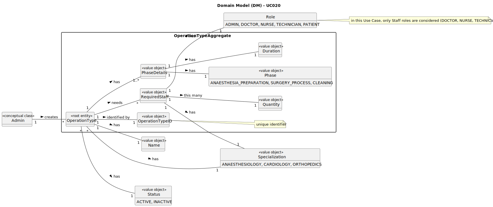

# UC020 - As an Admin, I want to add new types of operations, so that I can reflect the available medical procedures in the system

## 2. Analysis

### 2.1. Relevant Domain Model Excerpt

### 2.2. Process Specification

#### 2.2.1. Normal Flow

1. **Preconditions**: The Admin is logged in and has access to the backoffice management functionality.
2. **Select Option**: The Admin chooses to register a new type of operation.
3. **Enter Operation Type Details**: The Admin enters the operation name, specialization, estimated duration for each phase (anaesthesia/preparation, surgery and cleaning) and list of required staff (role, specialization and quantity).
4. **Validate Operation Name**: The system checks if the operation name is unique.
5. **Save Operation Type**: The system saves the new operation type in the database and assigns it an unique ID.
6. **Log Creation**: The system logs the creation of the new operation type.
7. **Make Operation Type Available**: The system makes the new operation type available for scheduling immediately.

#### 2.2.2. Exceptional Flows

- **EF020.1**: If the operation name is not unique, the system must notify the Admin and request a different name.
- **EF020.2**: If the operation type cannot be saved, the system must notify the Admin and log the error.

### 2.3. Functional Requirements Reevaluation

- **FR020.1**: The system shall allow the Admin to add new types of operations, providing the operation name, specialization, estimated duration for each phase, and required staff (role, specialization, quantity).

### 2.4. Non-functional Requirements Specification

- **Functionality**: The system shall allow the Admin to add new types of operations with the required details.
- **Usability**: The interface should be intuitive, guiding the Admin smoothly through the operation type creation process with clear instructions and error handling.
- **Reliability**: The system shall validate the operation name to ensure uniqueness and provide feedback on the success or failure of the operation type creation process.
- **Performance**: The operation type creation process should complete within acceptable time limits to maintain system responsiveness.
- **Supportability**: The system shall log the creation of new operation types for audit purposes and make them available for scheduling immediately.

### 2.5. Data Integrity and Security

- Data integrity measures should ensure that operation types are accurately recorded and reflected in the system without compromising data consistency.
- Security measures should prevent unauthorized access to operation type creation functionality and protect sensitive operation data.
- The system should validate the operation name to ensure that it is unique and prevent duplicate entries.

### 2.6. Interface Design

- The interface shall be user-friendly, providing a clear workflow for creating new operation types with input fields for operation name, specialization, estimated duration for each phase, and required staff details.

### 2.7. Risk Analysis

- **R020.1**: Duplicate Operation Name
  - **Mitigation**: Implement a validation mechanism to check for duplicate operation names and notify the Admin to provide a unique name.
- **R020.2**: Database Error During Operation Type Creation
  - **Mitigation**: Implement error handling mechanisms to log the error and notify the Admin of the issue.
- **R020.3**: Unauthorized Access to Operation Type Creation
  - **Mitigation**: Implement secure access control mechanisms to restrict operation type creation to authorized Admin users.

### 2.8. Decisions

- **D020.1**: Use a validation mechanism to ensure the uniqueness of operation names during creation.
- **D020.2**: Implement error handling to log and notify the Admin of any issues during operation type creation.
- **D020.3**: Utilize secure access control mechanisms (with the help of the IAM) to prevent unauthorized access to operation type creation functionality.
- **D020.4**: Log the creation of new operation types for audit purposes and immediate availability for scheduling.
