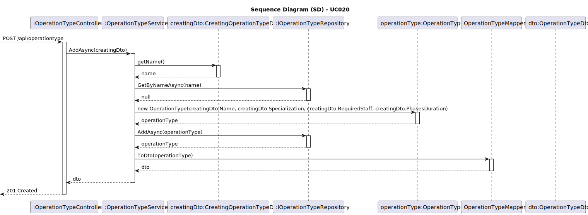
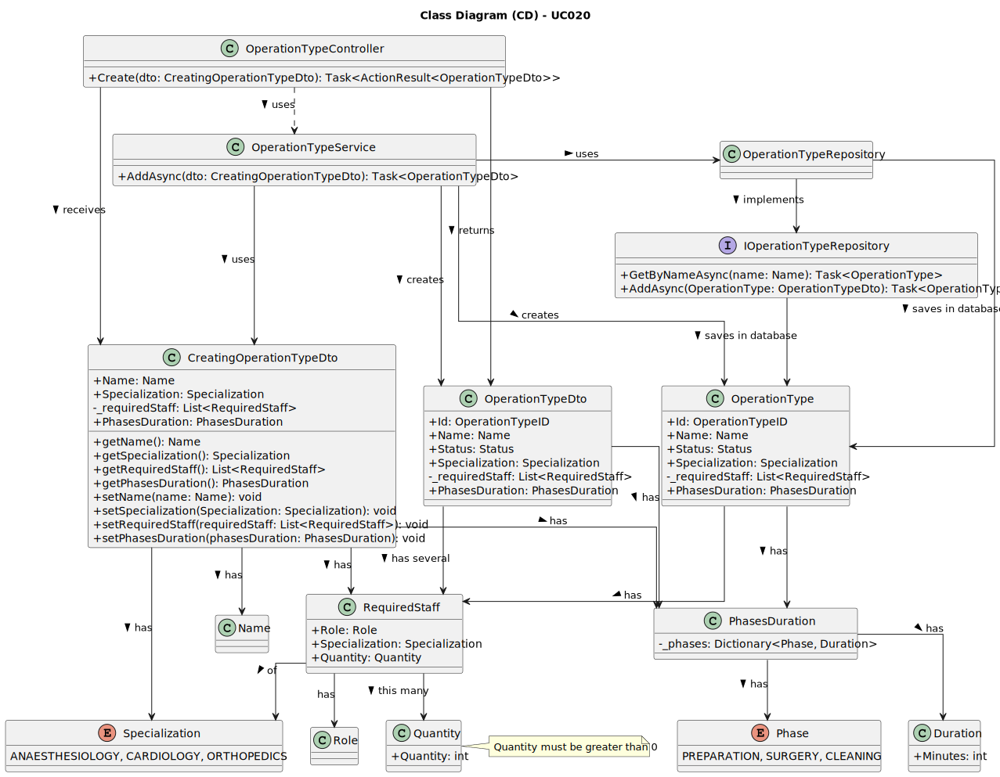

# UC020 - As an Admin, I want to add new types of operations, so that I can reflect the available medical procedures in the system

## 3. Design - Use Case Realization

### 3.1. Rationale

| Interaction ID                                       | Question: Which class is responsible for...         | Answer                              | Justification (with patterns)                                                                                                        |
|:-----------------------------------------------------|:----------------------------------------------------|:------------------------------------|:-------------------------------------------------------------------------------------------------------------------------------------|
| Step 1: Admin submits a request to add a new operation type. | **OperationTypeController**                          | Controller                          | The `OperationTypeController` manages the input from the Admin and initiates the creation flow for a new operation type, following the MVC (Model-View-Controller) pattern that promotes separation of concerns.                                     |
| Step 2: Create a DTO to encapsulate operation type data. | **CreatingOperationTypeDto**                        | DTO                                 | The `CreatingOperationTypeDto` acts as a Data Transfer Object, encapsulating all necessary parameters for creating an operation type. This ensures that only valid data is passed between layers, adhering to the Dependency Injection principle.     |
| Step 3: Validate the operation type name.           | **OperationTypeService**                             | Service                             | The `OperationTypeService` implements the business logic that validates the operation type name, using Business Validation approaches from DDD to ensure the system does not allow duplicates and maintains data integrity.                                     |
| Step 4: Check if the operation type already exists. | **OperationTypeRepository**                          | Repository                          | The `OperationTypeRepository` interacts with the database through queries, using the Repository pattern to separate data access logic from business logic. It checks for the existence of the operation type by the provided name.                      |
| Step 5: Create a new operation type object.         | **OperationType**                                   | Domain                              | The `OperationType` class represents the domain model encapsulating all characteristics and behaviors of an operation type. When creating a new instance, it ensures that all required attributes are correctly filled, following the Aggregate Root pattern of DDD. |
| Step 6: Save the new operation type to the database.| **IOperationTypeRepository**                        | IOperationTypeRepository            | The `IOperationTypeRepository` interface defines a contract for persisting operation types. The repository implementation ensures that the new operation type is saved correctly to the database, respecting access and storage rules defined in DDD.                             |

### Systematization

According to the taken rationale, the conceptual classes promoted to software classes are:

* **OperationTypeController**: Responsible for managing HTTP requests, orchestrating the interaction between business logic and presentation. This controller is the entry point for the creation of new operation types.
* **CreatingOperationTypeDto**: Serves as a transfer object that encapsulates the input data necessary for creating an operation type. This not only promotes a clear separation between system layers but also ensures that validation occurs at the right moment.
* **OperationTypeService**: Centralizes business logic and validation, applying the necessary business rules to ensure that operation types are created consistently and without duplication.
* **OperationTypeRepository**: Implements data access logic, following the Repository pattern to isolate persistence logic from the rest of the application. This repository is responsible for interacting with the underlying data source.
* **IOperationTypeRepository**: Interface that defines data access operations for operation types, allowing for different backend implementations without affecting business logic.
* **OperationType**: Domain model representing operations themselves, maintaining relevant properties and behaviors that can be used in various parts of the system.

Other software classes (i.e., Pure Fabrication) identified:

* **Quantity**: Represents the required quantity of staff for the operation, encapsulating logic and validation rules that ensure the numbers are always valid and positive.
* **RequiredStaff**: Stores the role, specialization and the required quantity for each type of operation, allowing for clear and accessible logic for staff requests and assignments.

## 3.2. Sequence Diagram (SD)

## 3.3. Class Diagram (CD)

