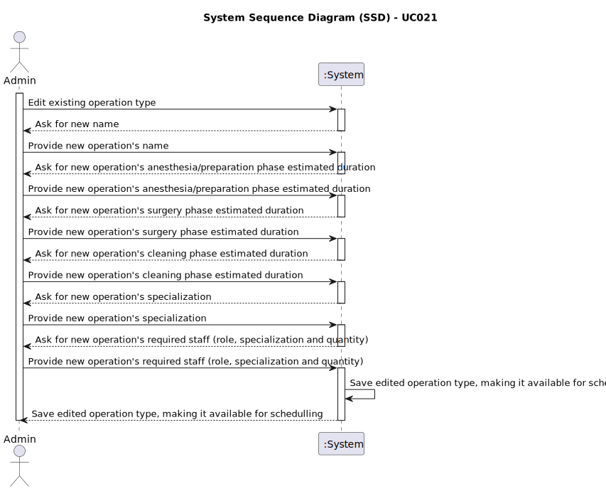

# UC021 - As an Admin, I want to edit existing operation types, so that I can update or correct information about the procedure

## 1. Requirements Engineering

### 1.1. Use Case Description

> As Admin, I want to edit existing operation types.
---

### 1.2. Customer Specifications and Clarifications

**From the specifications document:**

- Operation types are medical procedures that can be performed at the hospital.
- Admin must be able to add, edit, delete, and list/search operations.
- When editing an already existing operation type, the Admin must be able to see several details, such as:
  - Name
  - Specialization
  - Required staff
  - Estimated duration
- After listing the operations types, the Admin must be able to delete a selected one.

**From the client clarifications:**

> **Question:** Can you clarify: "Historical data is maintained, but new operation requests will use the updated operation type information."?
> **Answer:** It means that if an operation type is changed we need to keep track of its changes. For instance,
Operation Type "A" is defined as taking 30 minutes preparation, 1h surgery and 30 minutes cleaning with a team of 1 doctor with specialization X and one nurse with specialization Y. Some operations are requested, scheduled and performed based on this definition. After sometime, the hospital changes its procedures and defines the operation type "A" as needing 30 min prep, 30 min. surgery and 30 min. cleaning, with a team of 3 doctors and one nurse. New operations will be requested, scheduled and performed using this new definition; however, we need to keep historical data, so that if the admin wants to know the details of an operation in the past, the system must show the operation type as it was defined at the time of the operation request.

### 1.3. Acceptance Criteria

> AC021.1: Admins can search for and select an existing operation type to edit.
> AC021.2: Editable fields include operation name, required staff by specialization, and estimated duration.
> AC021.3: Changes are reflected in the system immediately for future operation requests.
> AC021.4: Historical data is maintained, but new operation requests will use the updated operation type information.

### 1.4. Found out Dependencies

- This Use Case is relative to US5.1.21, which is related to the operation types management functionality.
- It relates to the following Use Case(s) as well:
  - [UC020 (US5.1.20)](../UC020/README.md) - As an Admin, I want to add new types of operations, so that I can reflect the available medical procedures in the system.
  - [UC022 (US5.1.22)](../UC022/README.md) - As an Admin, I want to remove obsolete or no longer performed operation types, so that the system stays current with hospital practices.
  - [UC023 (US5.1.23)](../UC023/README.md) - As an Admin, I want to list/search operation types, so that I can see the details, edit and remove operation types.

### 1.5 Input and Output Data

**Input Data:**

- Typed data: operation name, estimated duration (for each phase).
- Selected data: specialization, required staff (role, specialization and quantity).
_Note_: Only changed what admin wants to edit.

**Output Data:**

- (In)sucess message.

### 1.6. System Sequence Diagram (SSD)

### 1.7 Other Relevant Remarks

- The system must ensure that the new operation name is unique.
- The system must store the time spent on each phase of the surgery.
- The operation type must be available for scheduling immediately after the changes are saved (status = active).
