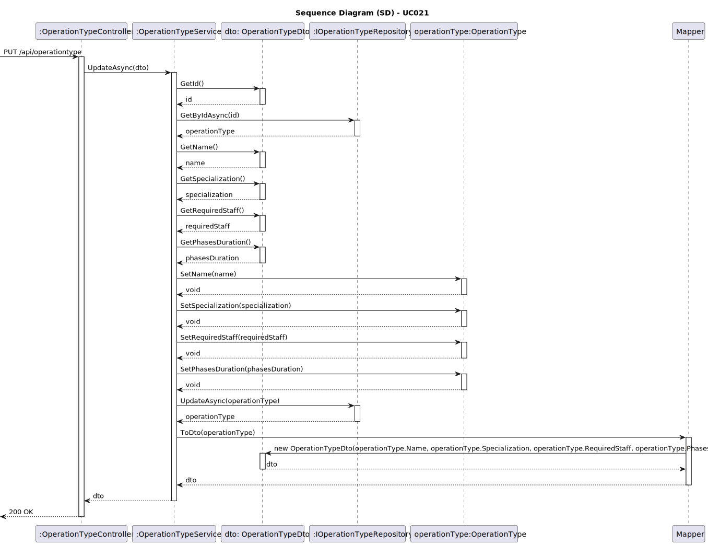
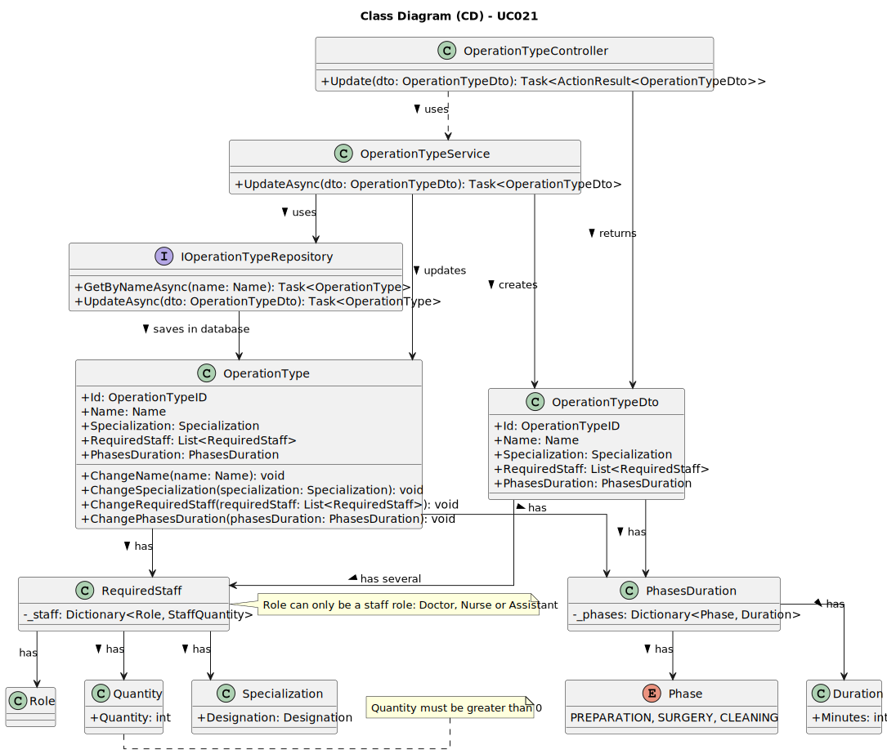

# UC022 - As an Admin, I want to remove obsolete or no longer performed operation types, so that the system stays current with hospital practices

## 3. Design - Use Case Realization

### 3.1. Rationale

| Interaction ID                                           | Question: Which class is responsible for...              | Answer                              | Justification (with patterns)                                                                                                        |
|:---------------------------------------------------------|:---------------------------------------------------------|:------------------------------------|:-------------------------------------------------------------------------------------------------------------------------------------|
| Step 1: Admin submits a request to inactivate an operation type. | **OperationTypeController**                               | Controller                          | The `OperationTypeController` manages the input from the Admin and initiates the flow for inactivating an operation type, following the MVC (Model-View-Controller) pattern that promotes separation of concerns.                                     |
| Step 2: Validate the operation type’s status.                  | **OperationTypeService**                                  | Service                             | The `OperationTypeService` implements the business logic that validates the operation type status, ensuring that only active types can be inactivated, using Business Validation approaches from DDD to maintain data integrity.                     |
| Step 3: Check if the operation type exists.                     | **OperationTypeRepository**                               | Repository                          | The `OperationTypeRepository` interacts with the database through queries, using the Repository pattern to separate data access logic from business logic. It checks for the existence of the operation type by the provided ID.                      |
| Step 4: Change the status of the operation type to inactive.    | **OperationType**                                         | Domain                              | The `OperationType` class represents the domain model, encapsulating all characteristics and behaviors of an operation type. It ensures that the type’s status is properly set to inactive, following the Aggregate Root pattern of DDD.             |
| Step 5: Save the inactivated operation type to the database.    | **IOperationTypeRepository**                              | IOperationTypeRepository            | The `IOperationTypeRepository` interface defines a contract for persisting operation types. The repository implementation ensures that the inactivated operation type is saved correctly to the database, respecting access and storage rules defined in DDD. |

### Systematization

According to the rationale, the conceptual classes promoted to software classes are:

- **OperationTypeController**: Responsible for managing HTTP requests, orchestrating the interaction between business logic and presentation. This controller is the entry point for inactivating operation types.
- **OperationTypeService**: Centralizes business logic and validation, applying the necessary business rules to ensure that operation types are inactivated correctly and only when applicable.
- **OperationTypeRepository**: Implements data access logic, following the Repository pattern to isolate persistence logic from the rest of the application. This repository is responsible for interacting with the underlying data source.
- **IOperationTypeRepository**: Interface that defines data access operations for operation types, allowing for different backend implementations without affecting business logic.
- **OperationType**: Domain model representing operations themselves, maintaining relevant properties and behaviors that ensure operation types are correctly inactivated and handled within the system.

Other software classes (i.e., Pure Fabrication) identified:

- **Quantity**: Represents the required quantity of staff for the operation, encapsulating logic and validation rules that ensure the numbers are always valid and positive.
- **RequiredStaff**: Stores the roles and their required quantities for each type of operation, allowing for clear and accessible logic for staff requests and assignments.

### 3.2. Sequence Diagram (SD)

### 3.3. Class Diagram (CD)

