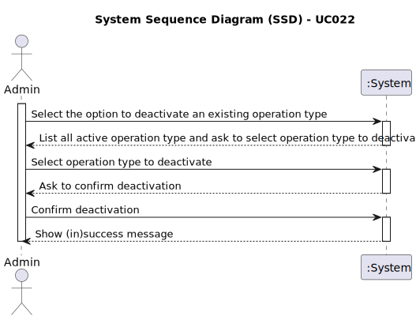

# UC022 - As an Admin, I want to remove obsolete or no longer performed operation types, so that the system stays current with hospital practices

## 1. Requirements Engineering

### 1.1. Use Case Description

> As Admin, I want to deactivate existing operation types.
---

### 1.2. Customer Specifications and Clarifications

**From the specifications document:**

- Operation types are medical procedures that can be performed at the hospital.
- Admin must be able to add, edit, delete, and list/search operations.
- When deactivating an already existing operation type, the Admin must first list the operation types and then select the one to be deactivated.

**From the client clarifications:**

> **Question:** Is marking operation types intended to be permanent, or should we anticipate the possibility of reactivating them in the future?
> **Answer:** For now you don't need to implement reactivating a previously deactivated operation type, but that might be a requirement in the future.

### 1.3. Acceptance Criteria

> AC022.1: Admins can search for and mark operation types as inactive (rather than deleting them) to preserve historical records.
> AC022.2: Inactive operation types are no longer available for future scheduling but remain in historical data.
> AC022.3: A confirmation prompt is shown before deactivating an operation type.

### 1.4. Found out Dependencies

- This Use Case is relative to US5.1.21, which is related to the operation types management functionality.
- It relates to the following Use Case(s) as well:
  - [UC020 (US5.1.20)](../UC020/README.md) - As an Admin, I want to add new types of operations, so that I can reflect the available medical procedures in the system.
  - [UC021 (US5.1.21)](../UC022/README.md) - As an Admin, I want to edit existing operation types, so that I can update or correct information about the procedure.
  - [UC023 (US5.1.23)](../UC023/README.md) - As an Admin, I want to list/search operation types, so that I can see the details, edit and remove operation types.

### 1.5 Input and Output Data

**Input Data:**

- Typed data: N.A.
- Selected data: operation type to be deactivated, confirmation.

**Output Data:**

- List of operation types.
- Confirmation prompt.
- (In)success message.

### 1.6. System Sequence Diagram (SSD)

### 1.7 Other Relevant Remarks

- The system must ensure that the new operation name is unique.
- The system must store the time spent on each phase of the surgery.
- The status of the operation type must be updated to `inactive` when it is deactivated.
