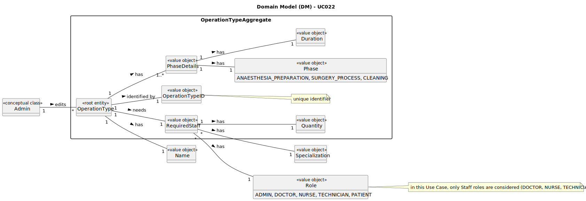

# UC022 - As an Admin, I want to remove obsolete or no longer performed operation types, so that the system stays current with hospital practices

## 2. Analysis

### 2.1. Relevant Domain Model Excerpt

### 2.2. Process Specification

#### 2.2.1. Normal Flow

1. **Preconditions**: The Admin is logged in and has access to the backoffice management functionality.
2. **Select Option**: The Admin chooses to deactivate an existing type of operation.
3. **List Operation Types**: The system presents a list of existing operation types.
4. **Select Operation Type**: The Admin selects the operation type to be deactivated.
5. **Confirm Deactivation**: The system prompts the Admin to confirm the deactivation of the selected operation type.
6. **Deactivate Operation Type**: The Admin confirms the deactivation, and the system marks the operation type as inactive.
7. **Database Update**: The operation type is marked as inactive and is no longer available for scheduling.

#### 2.2.2. Exceptional Flows

- **EF022.1**: If the database operation to mark the operation type as inactive fails, the system shall notify the Admin of the issue and log the error.

### 2.3. Functional Requirements Reevaluation

- **FR022.1**: The system shall allow the Admin to search for and mark operation types as inactive.

### 2.4. Non-functional Requirements Specification

- **Functionality**: The system shall allow the Admin to deactivate existing operation types, providing a clear workflow for selecting and confirming the deactivation.
- **Usability**: The interface should be intuitive, guiding the Admin smoothly through the operation type deactivating process with clear instructions and error handling.
- **Reliability**: The system shall ensure that the operation type deactivation process is completed successfully and that the operation type is marked as inactive in the database.
- **Performance**: The operation type deactivating process should complete within acceptable time limits to maintain system responsiveness.
- **Supportability**: The system shall log the deactivation of operation types for audit purposes and make them unavailable for scheduling immediately.

### 2.5. Data Integrity and Security

- Data integrity measures should ensure that operation types are accurately recorded and reflected in the system without compromising data consistency.
- Security measures should prevent unauthorized access to operation type deactivating functionality and protect sensitive operation data.

### 2.6. Interface Design

- The interface shall be user-friendly, providing a clear workflow for deactivating operation types with intuitive controls and informative feedback.

### 2.7. Risk Analysis

- **R022.1**: Database Error During Operation Type Deactivation
  - **Mitigation**: Implement error handling mechanisms to log the error and notify the Admin of the issue.
- **R022.2**: Unauthorized Access to Operation Type Deactivation
  - **Mitigation**: Implement secure access control mechanisms to restrict operation type deactivation to authorized Admin users.

### 2.8. Decisions

- **D022.1**: Implement error handling to log and notify the Admin of any issues during operation type deactivation.
- **D022.2**: Utilize secure access control mechanisms (with the help of the IAM) to prevent unauthorized access to operation type deactivation functionality.
- **D022.3**: Log the deactivation of new operation types for audit purposes and immediate unavailability for scheduling.
