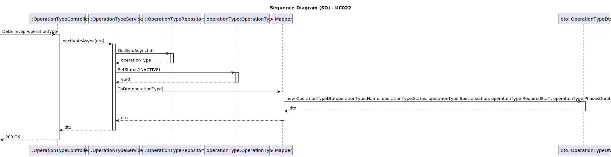
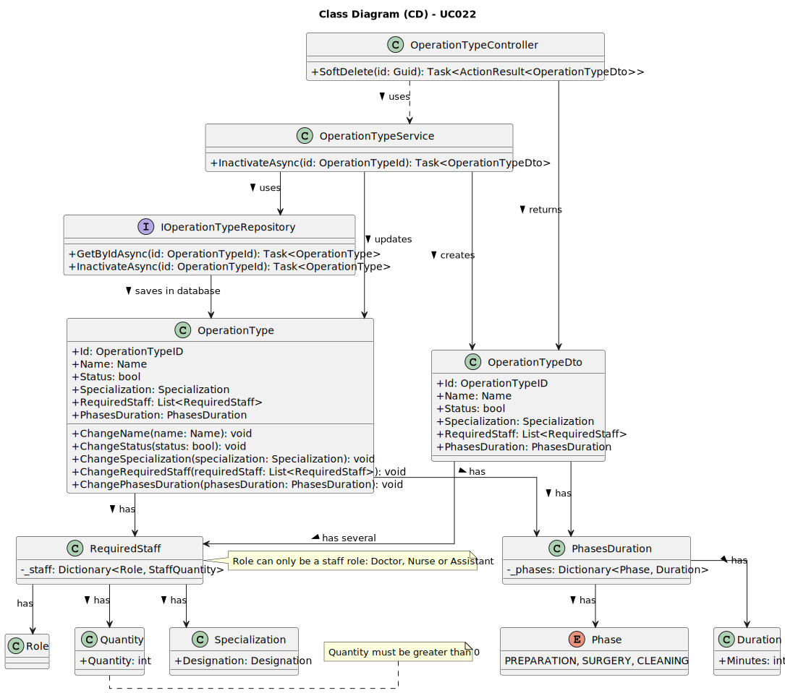

# UC022 - As an Admin, I want to remove obsolete or no longer performed operation types, so that the system stays current with hospital practices

## 3. Design - Use Case Realization

### 3.1. Rationale

| Interaction ID                                       | Question: Which class is responsible for...         | Answer                              | Justification (with patterns)                                                                                                        |
|:-----------------------------------------------------|:----------------------------------------------------|:------------------------------------|:-------------------------------------------------------------------------------------------------------------------------------------|
| Step 1: Admin submits a request to inactivate an operation type. | **OperationTypeController**                          | Controller                          | The `OperationTypeController` manages the input from the Admin and initiates the inactivation flow for an existing operation type, following the MVC (Model-View-Controller) pattern that promotes separation of concerns.                                     |
| Step 2: Validate the operation type’s status.                  | **OperationTypeService**                             | Service                             | The `OperationTypeService` handles the business logic to validate the operation type, ensuring that the type is active before inactivation, applying Business Validation from DDD to ensure system integrity.                                             |
| Step 3: Check if the operation type exists.                     | **OperationTypeRepository**                          | Repository                          | The `OperationTypeRepository` interacts with the database using the Repository pattern to separate data access from business logic. It checks if the operation type already exists before attempting to update its status.                                 |
| Step 4: Inactivate the operation type object.                   | **OperationType**                                   | Domain                              | The `OperationType` class represents the domain model, encapsulating the characteristics and behaviors of an operation type. It changes the type's status to inactive following the Aggregate Root pattern of DDD.                                       |
| Step 5: Save the inactivated operation type to the database.     | **IOperationTypeRepository**                         | IOperationTypeRepository            | The `IOperationTypeRepository` interface defines a contract for persisting operation types. The repository ensures the correct update of the operation type in the database, adhering to the rules of the system’s data access layer.                    |

### Systematization

According to the rationale, the conceptual classes promoted to software classes are:

- **OperationTypeController**: Responsible for managing HTTP requests, orchestrating the interaction between business logic and presentation. This controller is the entry point for inactivating existing operation types.
- **OperationTypeService**: Centralizes business logic and validation, applying the necessary business rules to ensure that operation types are inactivated in line with hospital practices.
- **OperationTypeRepository**: Implements data access logic, following the Repository pattern to isolate persistence logic from the rest of the application. This repository is responsible for interacting with the underlying data source.
- **IOperationTypeRepository**: Interface that defines data access operations for operation types, allowing for different backend implementations without affecting business logic.
- **OperationType**: Domain model representing operations themselves, maintaining relevant properties and behaviors that ensure the correct handling of operation types across the system.

Other software classes (i.e., Pure Fabrication) identified:

- **Quantity**: Represents the required quantity of staff for the operation, encapsulating logic and validation rules that ensure the numbers are always valid and positive.
- **RequiredStaff**: Stores the roles and their required quantities for each type of operation, allowing for clear and accessible logic for staff requests and assignments.

### 3.2. Sequence Diagram (SD)

### 3.3. Class Diagram (CD)

