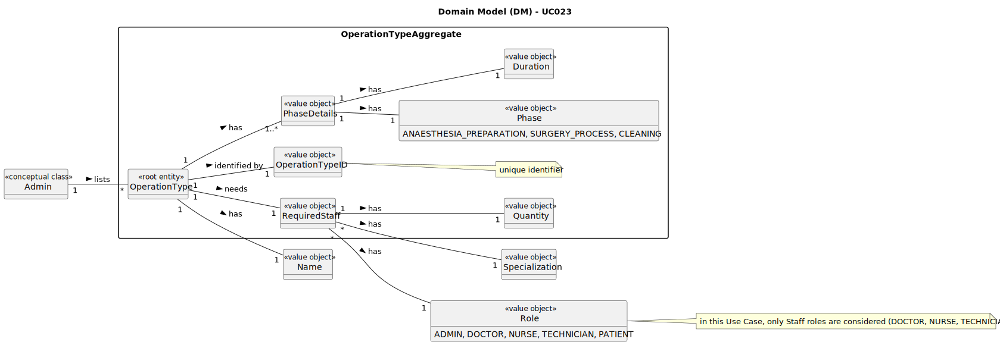

# UC023 - As an Admin, I want to list/search operation types, so that I can see the details, edit and remove operation types

## 2. Analysis

### 2.1. Relevant Domain Model Excerpt

### 2.2. Process Specification

#### 2.2.1. Normal Flow

1. **Preconditions**: The Admin is logged in and has access to the backoffice management functionality.
2. **Select Option**: The Admin chooses to list existing types of operation.
3. **Search Operation Types**: The system allows the Admin to search and filter operation types by name, specialization or status (active/inactive).
4. **Display Operation Types**: The system displays operation types in a searchable list with attributes such as name, required staff and estimated duration.
5. **Select Operation Type**: The Admin can select an operation type to view, edit or deactivate it.

#### 2.2.2. Exceptional Flows

- **EF023.1**: If the Admin tries to list operation types without being logged in as Admin, the system must redirect them to the login page.

### 2.3. Functional Requirements Reevaluation

- **FR023.1**: The system shall allow the Admin to search and filter operation types by name, specialization or status (active/inactive).
- **FR023.2**: The system shall display operation types in a searchable list with attributes such as name, required staff and estimated duration.

### 2.4. Non-functional Requirements Specification

- **Functionality**: The system shall allow the Admin to list existing operation types, providing a clear workflow for viewing operation information.
- **Usability**: The interface should be intuitive, guiding the Admin smoothly through the operation types listing process with clear instructions and error handling.
- **Reliability**: The system shall be available for operation types listing at all times, ensuring that the Admin can access the information when needed.
- **Performance**: The operation types listing process should complete within acceptable time limits to maintain system responsiveness.
- **Supportability**: The system shall log operation types listing activities for audit purposes and provide error handling mechanisms for issue resolution.

### 2.5. Data Integrity and Security

- Data integrity measures should ensure that operation types are accurately recorded and reflected in the system without compromising data consistency.
- Security measures should prevent unauthorized access to operation types listing functionality and protect sensitive operation data.

### 2.6. Interface Design

- The interface shall be user-friendly, providing a clear workflow for listing operation types with search and filter options.

### 2.7. Risk Analysis

- **R023.1**: Database Error During Operation Type Listing
  - **Mitigation**: Implement error handling mechanisms to log the error and notify the Admin of the issue.
- **R023.2**: Unauthorized Access to Operation Type Listing
  - **Mitigation**: Implement secure access control mechanisms to restrict operation types listing to authorized Admin users.

### 2.8. Decisions

- **D023.1**: The system shall use a search and filter mechanism to allow the Admin to find specific operation types efficiently.
- **D023.2**: The system shall display operation types in a list format with relevant attributes for easy viewing and selection.
- **D023.3**: The system shall provide error handling mechanisms to address issues during operation types listing.
