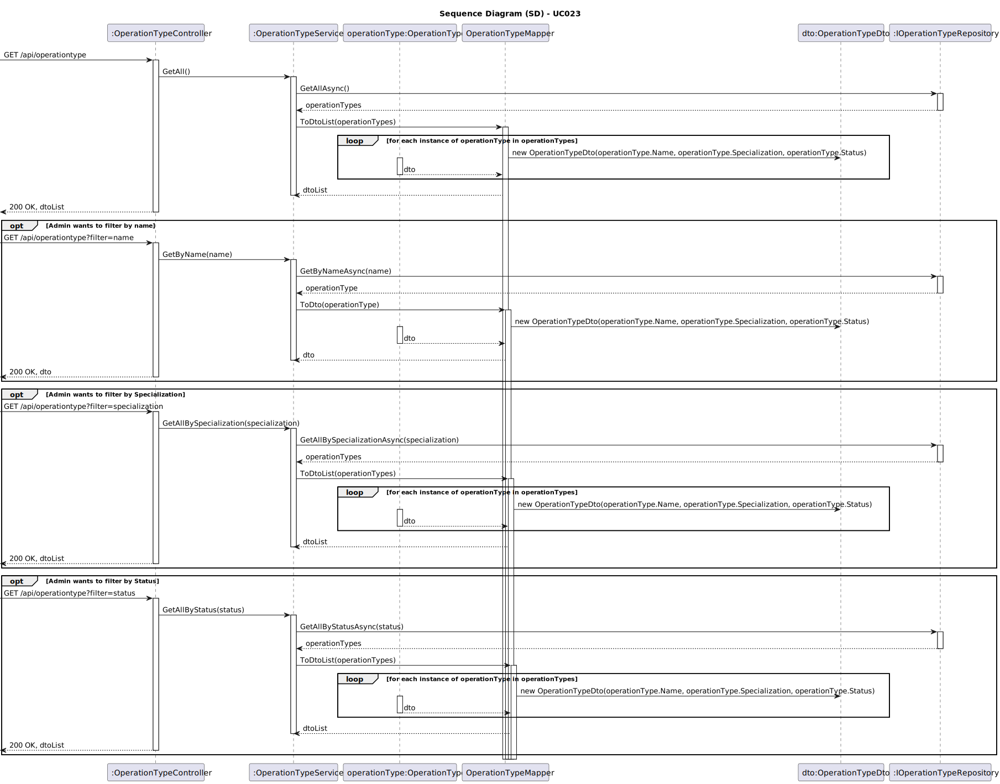
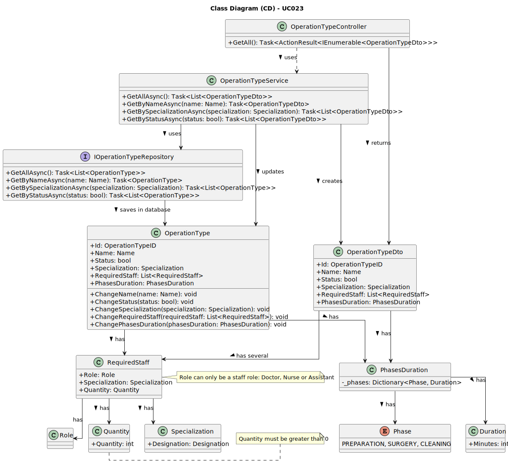

# UC023 - As an Admin, I want to list/search operation types, so that I can see the details, edit and remove operation types

## 3. Design - Use Case Realization

### 3.1. Rationale

| Interaction ID                                       | Question: Which class is responsible for...         | Answer                              | Justification (with patterns)                                                                                                        |
|:-----------------------------------------------------|:----------------------------------------------------|:------------------------------------|:-------------------------------------------------------------------------------------------------------------------------------------|
| Step 1: Admin submits a request to list all operation types. | **OperationTypeController**                          | Controller                          | The `OperationTypeController` manages the input from the Admin and initiates the request to list all operation types, following the MVC (Model-View-Controller) pattern that promotes separation of concerns.                                     |
| Step 2: Retrieve all operation types from the service. | **OperationTypeService**                             | Service                             | The `OperationTypeService` implements the business logic that retrieves all operation types, ensuring the system adheres to its rules and maintains consistency.                                     |
| Step 3: Access the repository to fetch data.       | **OperationTypeRepository**                          | Repository                          | The `OperationTypeRepository` interacts with the database through queries, using the Repository pattern to separate data access logic from business logic. It fetches the list of operation types.                      |
| Step 4: Return the operation types to the service.  | **IOperationTypeRepository**                        | IOperationTypeRepository            | The `IOperationTypeRepository` interface defines a contract for retrieving operation types. The repository implementation ensures that the data is fetched correctly from the database.                             |
| Step 5: Prepare the operation types for the controller. | **OperationTypeDto**                                   | DTO                                 | The `OperationTypeDto` acts as a Data Transfer Object, encapsulating all necessary parameters for the operation types, ensuring that only relevant data is passed between layers, adhering to the Dependency Injection principle.     |
| Step 6: Send the operation types back to the Admin. | **OperationTypeController**                          | Controller                          | The `OperationTypeController` receives the list of operation types and prepares to return them to the Admin, completing the request-response cycle properly.                             |

### Systematization

According to the rationale, the conceptual classes promoted to software classes are:

* **OperationTypeController**: Responsible for managing HTTP requests, orchestrating the interaction between business logic and presentation. This controller is the entry point for listing and searching operation types.
* **OperationTypeService**: Centralizes business logic and validation, applying the necessary business rules to ensure that operation types are retrieved consistently.
* **OperationTypeRepository**: Implements data access logic, following the Repository pattern to isolate persistence logic from the rest of the application. This repository is responsible for interacting with the underlying data source.
* **IOperationTypeRepository**: Interface that defines data access operations for operation types, allowing for different backend implementations without affecting business logic.
* **OperationTypeDto**: Data Transfer Object representing the properties of operation types, ensuring that only necessary data is sent to the client.

Other software classes (i.e., Pure Fabrication) identified:

* **Quantity**: Represents the required quantity of staff for the operation, encapsulating logic and validation rules that ensure the numbers are always valid and positive.
* **RequiredStaff**: Stores the roles and their required quantities for each type of operation, allowing for clear and accessible logic for staff requests and assignments.

### 3.2. Sequence Diagram (SD)

### 3.3. Class Diagram (CD)

