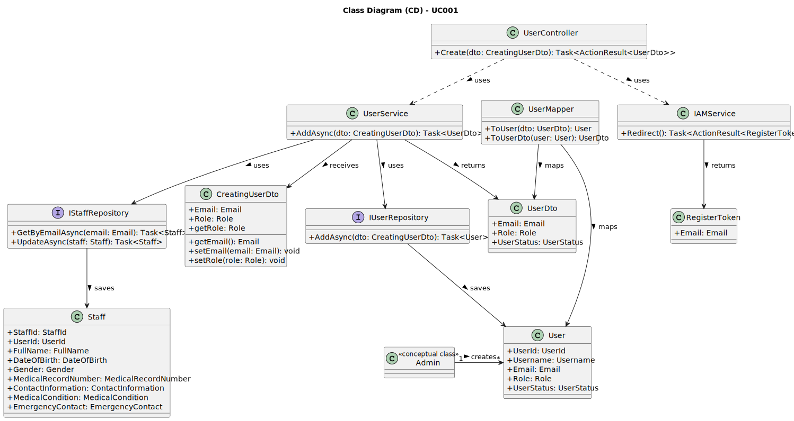

# UC001 - As Admin, I want to register new backoffice users (e.g., doctors, nurses, technicians, admins) via an out-of-band process, so that they can access the backoffice system with appropriate permissions

## 3. Design - Use Case Realization

### 3.1. Rationale

| Interaction ID                                       | Question: Which class is responsible for...         | Answer                              | Justification (with patterns)                                                                                                        |
|:-----------------------------------------------------|:----------------------------------------------------|:------------------------------------|:-------------------------------------------------------------------------------------------------------------------------------------|
| Step 1: Validate Username and Email                  | ... validating the uniqueness of the input username and email? | UserService                         | Service: UserService receives the input username and email from the admin, then checks the repository to ensure they are unique.      |
| Step 2: Create User                                  | ... creating and storing the user data?             | UserService                         | Service: UserService manages the process of user creation and interaction with the repository.                                       |
| Step 3: Store User                                   | ... saving the new user to the database?            | UserRepository                      | Information Expert: UserRepository is responsible for storing and retrieving user data from the database.                            |
| Step 4: Assign Role                                  | ... assigning a role to the new user?               | UserService                         | Service: UserService handles assigning the correct role (e.g., Doctor, Nurse) to the user based on input from the admin.             |
| Step 5: Send Confirmation Email                      | ... sending the email to the user?                  | UserService                         | Service: UserService is responsible for triggering the email confirmation process after user creation.                               |
| Step 6: Notify Admin                                 | ... notifying the admin of the operation success?   | UserController                      | Controller: UserController is responsible for sending feedback to the admin about the success or failure of the user creation.       |

### Systematization

According to the rationale above, the conceptual classes promoted to software classes are:

* User
* Username
* Email
* Role
* UserStatus

Other software classes (i.e. Pure Fabrication) identified:

* UserService
* UserRepository
* UserController

## 3.2. Sequence Diagram (SD)

## 3.3. Class Diagram (CD)

