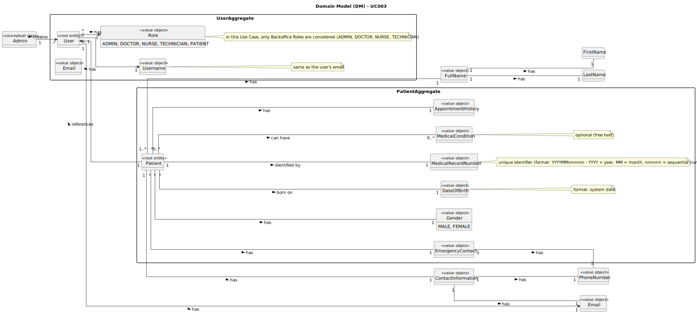

# UC003 - As a Patient, I want to register for the healthcare application, so that I can create a user profile and book appointments online

## 2. Analysis

### 2.1. Relevant Domain Model Excerpt

### 2.2. Process Specification

#### 2.2.1. Normal Flow

1. **Preconditions**: There exists a patient profile with the provided email.
2. **Select Option**: Patient selects the "Register" option on the login page.
3. **Provide Details**: Patient enters their email to check if it exists in the system.
4. **Validate Email**: The system validates the email to ensure it matches an existing patient profile's email.
5. **Redirect to IAM**: The system redirects the patient to the IAM to complete the registration process.
6. **Complete Registration**: Patient completes the registration process by providing the required details (email and password).
7. **Redirect to Healthcare App**: The IAM redirects the patient back to the healthcare application.
8. **Ask for Phone Number**: The system asks the patient to provide their phone number to verify identity.
9. **Create User Profile**: The system creates a user profile for the patient so that they can acess the system.

#### 2.2.2. Exceptional Flows

- **EF003.1**: If the email provided by the patient does not match an existing patient profile's email, the system shall display an error message and inform the patient to contact the healthcare provider.
- **EF003.2**: If the patient does not complete the registration process in the IAM, the system shall display an error message and inform the patient to try again.
- **EF003.3**: If the patient does not provide a phone number for verification, the system shall display an error message and inform the patient to provide a valid phone number.

### 2.3. Functional Requirements Reevaluation

- **FR003.1**: The system shall validate the email provided by the patient to ensure it matches an existing patient profile's email.
- **FR003.2**: The system shall redirect the patient to the IAM to complete the registration process.
- **FR003.3**: The IAM shall redirect the patient back to the healthcare application after completing the registration process.
- **FR003.4**: The system shall ask the patient to provide their phone number to verify their identity.

### 2.4. Non-functional Requirements Specification

- **Functionality**: The system shall allow the Patient to register for the healthcare application by providing their email and password (IAM) and verifying their phone number.
- **Usability**: The interface should be intuitive, guiding the Patient smoothly through the respective user creation process with clear instructions and error handling.
- **Reliability**: The system shall validate the email to ensure uniqueness and patient record's existence and provide feedback on the success or failure of the user creation process.
- **Performance**: The user creation process should complete within acceptable time limits to maintain system responsiveness.
- **Supportability**: The system shall log the creation of a new patient user for audit purposes and make them available immediately.

### 2.5. Data Integrity and Security

- Data integrity measures should ensure that users are accurately recorded and reflected in the system without compromising data consistency.
- Security measures should prevent unauthorized access to patient user creation functionality and protect sensitive userdata.
- The system should validate the username (email) to ensure that it is unique and prevent duplicate entries.

### 2.6. Interface Design

- The interface shall be user-friendly, providing a clear workflow for creating a new user for a patient profile with an input field for username/email and, after registration in the IAM, a field for the phone number.

### 2.7. Risk Analysis

- **R003.1**: Patient record with the provided email does not exist.
  - **Mitigation**: Display an error message and inform the patient to contact the healthcare provider.
- **R003.2**: Patient does not complete the registration process in the IAM.
  - **Mitigation**: Display an error message and inform the patient to try again.
- **R003.3**: Patient does not provide a phone number for verification.
  - **Mitigation**: Display an error message and inform the patient to provide a valid phone number.

### 2.8. Decisions

- **D003.1**: Use a validation mechanism to ensure the uniqueness of usernames during creation.
- **D003.2**: Implement error handling to log and notify the Patient of any issues during user creation.
- **D003.3**: Utilize secure access control mechanisms (with the help of the IAM) to prevent unauthorized access to user creation functionality.
- **D003.4**: Log the creation of new users for audit purposes and immediate availability in the system.
