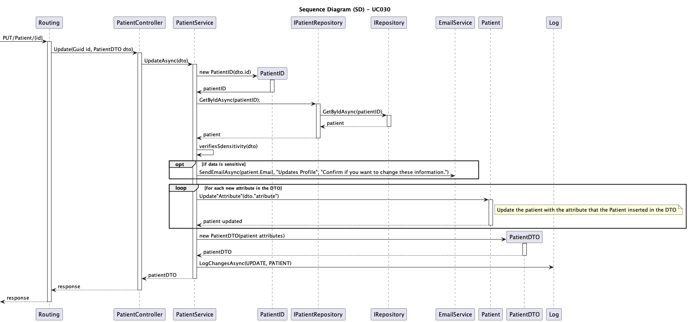
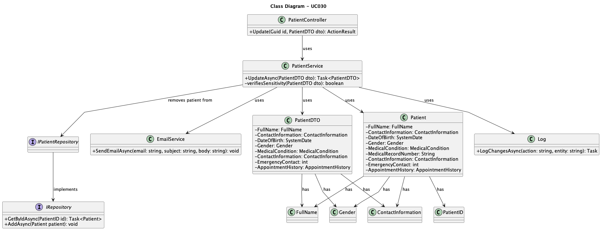

# UC004 -As a Patient, I want to update my user profile, so that I can change my personal details and preferences.

## 3. Design - Use Case Realization

### 3.1. Rationale

| Interaction ID                                       | Question: Which class is responsible for...                 | Answer                          | Justification (with patterns)                                                                                                     |
|:-----------------------------------------------------|:------------------------------------------------------------|:--------------------------------|:----------------------------------------------------------------------------------------------------------------------------------|
| Step 1: Update Patient                               | ... receiving the update request?                            | Routing                         | Controller: Routing is responsible for receiving the update request from the client.                                               |
|                                                      | ... handling the update process?                             | PatientController               | Controller: PatientController is responsible for initiating the update process.                                                    |
|                                                      | ... verifying sensitive data changes?                        | PatientService                  | Service: PatientService processes the update and verifies whether the data is sensitive.                                           |
| Step 2: Notify Patient                               | ... sending email to the patient?                            | EmailService                    | Service: EmailService handles sending an email to the patient when sensitive data is changed.                                      |
| Step 3: Update Database                              | ... updating patient information in the database?            | IPatientRepository              | Information Expert: IPatientRepository is responsible for updating the patient’s information in the database.                     |
|                                                      | ... logging the changes made to the patient?                 | Log                             | Pure Fabrication: Log is responsible for logging the changes made to the patient’s information.                                    |
| Step 4: Return the result                            | ... returning the updated patient details to the client?     | PatientController               | Controller: PatientController returns the updated patient information to the client.                                               |

### Systematization

According to the rationale, the conceptual classes promoted to software classes are:

* Patient
* PatientID
* IPatientRepository
* IRepository

Other software classes (i.e., Pure Fabrication) identified:

* Routing
* PatientController
* PatientService
* EmailService
* Log

## 3.2. Sequence Diagram (SD)

## 3.3. Class Diagram (CD)

