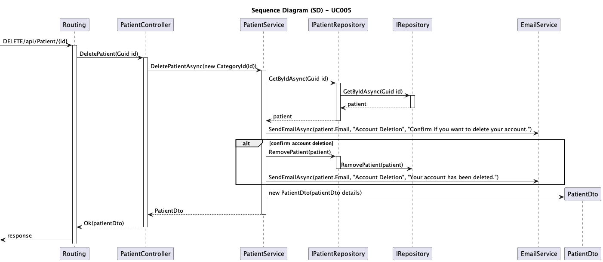
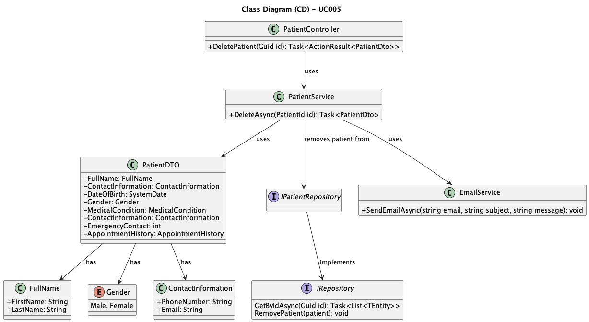

# UC030 - As a Patient, I want to delete my account and all associated data, so that I can exercise my right to be forgotten as per GDPR.

## 3. Design - Use Case Realization

### 3.1. Rationale

| Interaction ID                                      | Question: Which class is responsible for...                | Answer                          | Justification (with patterns)                                                                                     |
|:----------------------------------------------------|:-----------------------------------------------------------|:--------------------------------|:------------------------------------------------------------------------------------------------------------------|
| Step 1: Receive delete request                      | ... triggering the delete process?                         | Routing                         | Controller: Routing is responsible for receiving the delete request from the client.                              |
|                                                     | ... passing the patient ID to the controller?               | Routing                         | Controller: Routing passes the patient ID to the appropriate controller.                                           |
| Step 2: Retrieve the patient                        | ... handling the business logic for deleting a patient?     | PatientService                  | Service: PatientService manages the delete logic, including verifying and processing the patient's data.           |
|                                                     | ... retrieving patient data from the repository?            | IPatientRepository              | Information Expert: IPatientRepository is responsible for accessing the data of the patient to be deleted.         |
|                                                     | ... fetching the patient from the database?                 | IRepository                     | Information Expert: IRepository interacts with the database to retrieve the patient.                               |
| Step 3: Send account deletion confirmation          | ... sending the confirmation email?                        | EmailService                    | Service: EmailService is responsible for sending the account deletion confirmation email to the patient.           |
|                                                     | ... deleting the patient from the repository?               | IPatientRepository              | Information Expert: IPatientRepository manages the deletion of the patient from the system.                        |
| Step 4: Notify patient of successful deletion       | ... sending the final account deletion notification?        | EmailService                    | Service: EmailService sends the final notification after the patient's account is successfully deleted.            |
| Step 5: Return response to the client               | ... returning the result of the deletion process?           | Routing                         | Controller: Routing returns the success or failure of the deletion process to the client.                          |

### Systematization

According to the rationale, the conceptual classes promoted to software classes are:

* PatientDto
* IPatientRepository
* IRepository
* EmailService

Other software classes (i.e., Pure Fabrication) identified:

* Routing
* PatientService

## 3.2. Sequence Diagram (SD)

## 3.3. Class Diagram (CD)

