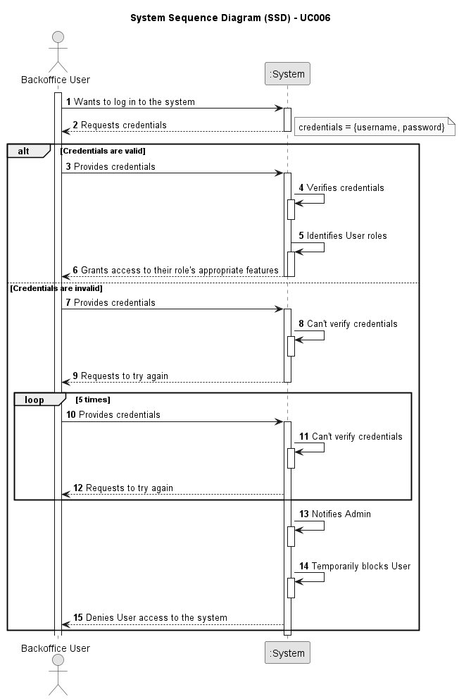

# UC006 - As a (non-authenticated) Backoffice User, I want to log in to the system using my credentials, so that I can access the backoffice features according to my assigned role.

## 1. Requirements Engineering

### 1.1. Use Case Description

> As a (non-authenticated) Backoffice User, I want to log in to the system using my credentials, so that I can access the backoffice features according to my assigned role.

---

### 1.2. Customer Specifications and Clarifications

**From the specifications document:**

- The solution should be deployed using several network nodes. It is expected that, at least, the relational
  database server and the Follow Up Server be deployed in nodes diferent from localhost, preferably in the cloud. The e-mail notification
  tasks must be executed in background by the Follow Up Server.

**From the client clarifications:**

n/a

> **Question:** -
> 
> **Answer:** -

---

### 1.3. Acceptance Criteria

> AC006.1: Backoffice users log in using their username and password.
> AC006.2: Role-based access control ensures that users only have access to features appropriate to their role (e.g., doctors can manage appointments, admins can manage users and settings).
> AC006.3: After five failed login attempts, the user account is temporarily locked, and a notification is sent to the admin.
> AC006.4: Login sessions expire after a period of inactivity to ensure security.

---

### 1.4. Found out Dependencies

* This Use Case is relative to US 5.1.7, which is related to IAM's funcionalities.
* It relates to the following Use Cases as well:
C007 (US5.1.7)
  - [UC007](../../UC007/README.md) - As a Patient, I want to log in to the healthcare system using my external IAM credentials, so that I can access my appointments, medical records, and other features securely.

### 1.5 Input and Output Data

**Input Data:**

- Typed data:
  - Username
  - Password

- Automatic data:
	- Role

**Output Data:**
- Notification sent to admin (in case of 5 failed login attempts).
- Success message (in case it validates the login).

### 1.6. System Sequence Diagram (SSD)

### 1.7 Other Relevant Remarks

n/a