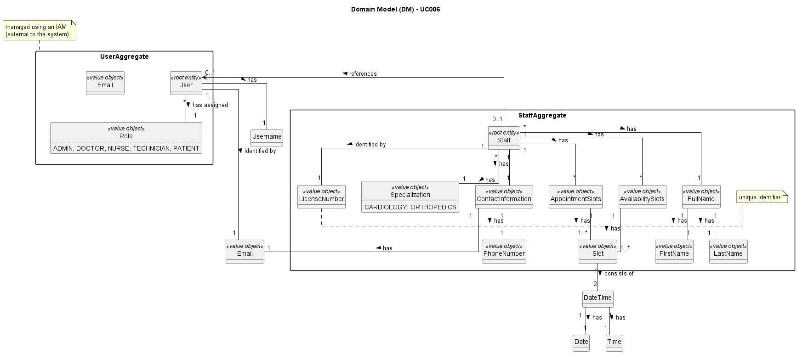

# UC006 - As a (non-authenticated) Backoffice User, I want to log in to the system using my credentials, so that I can access the backoffice features according to my assigned role.

## 2. Analysis

### 2.1. Relevant Domain Model Excerpt

### 2.2. Process Specification

#### 2.2.1. Normal Flow
1. **Login User**: Using the correct credentials, the Backoffice User will provider their username and password to log in to the system.
2. **System Identifies User Role**: Using the User username, the system obtains their specific role.
3. **Feedback**: The system provides feedback to the Backoffice User on the success or failure of their log in.

#### 2.2.2. Exceptional Flows
- **EF006.1**: If the credentials aren't valid, the system provides 5 tries; if they all fail, an email is sent to Admin.

### 2.3. Functional Requirements Reevaluation
- **FR006.1**: The system shall authenticate the User before letting it log in to the system.

### 2.4. Non-functional Requirements Specification
- **Security**: Implement access control mechanisms to ensure that only authorized Backoffice Users can manage specific data according to their roles.
- **Performance**: Ensure the log in process completes within acceptable time limits to maintain system responsiveness.
- **Usability**: Interface should be intuitive, guiding the Backoffice User smoothly through the notification process with clear instructions and error handling.

### 2.5. Data Integrity and Security
- Data integrity measures should ensure that notification actions are accurately recorded and reflected in the system without compromising data consistency.
- Security measures should prevent unauthorized access to notification functionality and protect sensitive candidate data.

### 2.6. Interface Design
- The interface will follow the EAPLI framework's design patterns, providing a user-friendly experience for the Backoffice User.
- The interface should provide an intuitive and efficient workflow for selecting candidates and sending notifications, with clear indications of success or failure.

### 2.7. Risk Analysis
- **R006.1**: System Error During Log In
    - **Mitigation**: Implement error handling mechanisms to notify the Backoffice User of any system failures and provide guidance on how to proceed.
- **R006.2**: Unauthorized Access to Backoffice User API
  - **Mitigation**: Implement secure encryption standards for storing and transmitting user credentials to prevent unauthorized access.

### 2.8. Decisions
- **D006.1**: Use the provided domain model as a reference for implementing notification functionality.