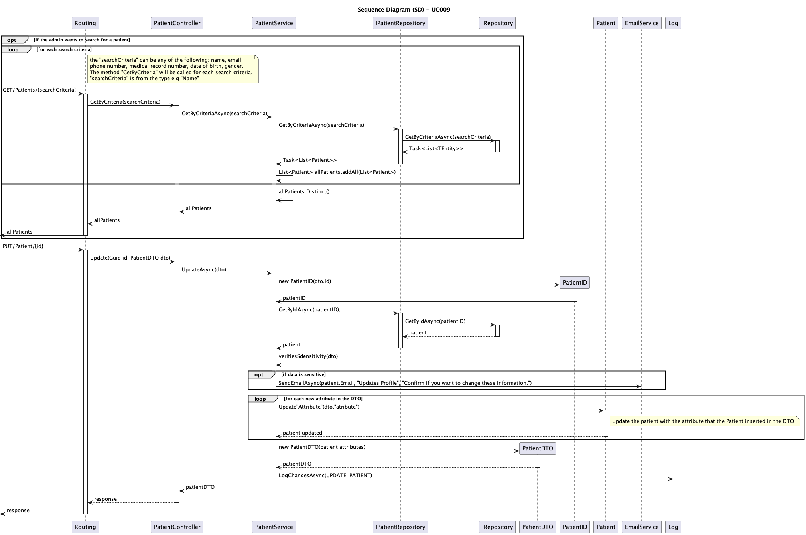
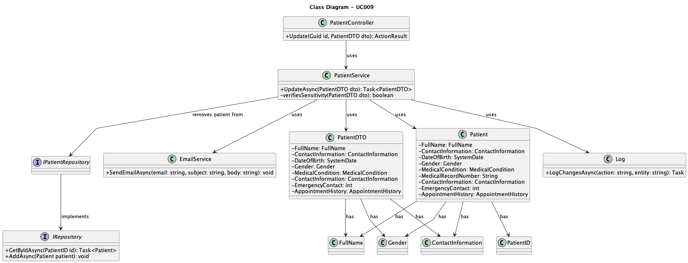

# UC009 - As an Admin, I want to edit an existing patient profile, so that I can update their information when needed.

## 3. Design - Use Case Realization

### 3.1. Rationale

## 3. Design - Use Case Realization

### 3.1. Rationale

| Interaction ID                                       | Question: Which class is responsible for...                 | Answer                          | Justification (with patterns)                                                                                                     |
|:-----------------------------------------------------|:------------------------------------------------------------|:--------------------------------|:----------------------------------------------------------------------------------------------------------------------------------|
| Step 1: Search Patient                               | ... initiating the search for a patient?                     | Routing                         | Controller: Routing is responsible for initiating the request for patient search.                                                 |
|                                                      | ... handling the patient search logic?                       | PatientController               | Controller: PatientController is responsible for managing the search request.                                                     |
|                                                      | ... fetching patient data based on criteria?                 | IPatientRepository              | Information Expert: IPatientRepository is responsible for retrieving patient data from the repository based on search criteria.   |
|                                                      | ... querying the database with the search criteria?          | IRepository                     | Information Expert: IRepository queries the database based on the search criteria provided.                                       |
|                                                      | ... combining and filtering patient search results?          | PatientService                  | Service: PatientService processes and filters patient search results to remove duplicates.                                        |
| Step 2: Update Patient                               | ... receiving the patient update request?                    | Routing                         | Controller: Routing is responsible for receiving the update request from the client.                                               |
|                                                      | ... managing the update process?                             | PatientController               | Controller: PatientController is responsible for initiating the update process.                                                    |
|                                                      | ... verifying the patient's identity?                        | PatientID                       | Information Expert: PatientID verifies the patient’s identity.                                                                    |
|                                                      | ... retrieving the current patient information?              | IPatientRepository              | Information Expert: IPatientRepository retrieves the patient’s existing data.                                                     |
|                                                      | ... checking if sensitive information has changed?           | PatientService                  | Service: PatientService verifies whether the updated information includes sensitive data changes.                                 |
|                                                      | ... sending email notifications for sensitive data changes?  | EmailService                    | Service: EmailService sends email notifications when sensitive information is updated.                                            |
|                                                      | ... updating patient attributes?                             | Patient                         | Information Expert: Patient is responsible for holding and updating the patient’s attributes.                                     |
|                                                      | ... logging the changes made to the patient record?          | Log                             | Pure Fabrication: Log is responsible for recording the changes made to the patient's information.                                 |
| Step 3: Return Response                              | ... returning the updated patient data to the client?        | PatientController               | Controller: PatientController returns the updated patient information to the client.                                               |

### Systematization

According to the rationale, the conceptual classes promoted to software classes are:

* Patient
* PatientID
* IPatientRepository
* IRepository

Other software classes (i.e., Pure Fabrication) identified:

* Routing
* PatientController
* PatientService
* EmailService
* Log
## 3.2. Sequence Diagram (SD)

## 3.3. Class Diagram (CD)

