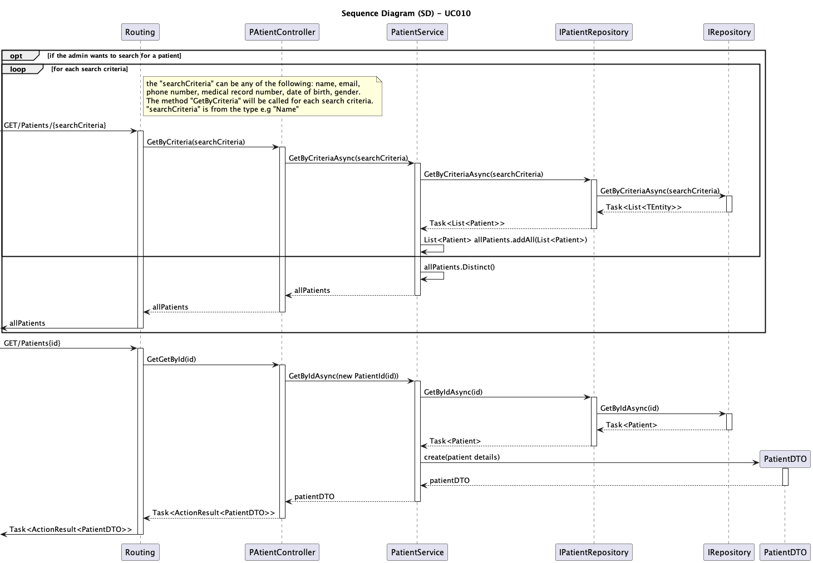

# UC010 - As an Admin, I want to delete a patient profile, so that I can remove patients who are no longer under care

## 3. Design - Use Case Realization

### 3.1. Rationale
| Interaction ID                                       | Question: Which class is responsible for...                    | Answer                          | Justification (with patterns)                                                                                     |
|:-----------------------------------------------------|:---------------------------------------------------------------|:--------------------------------|:------------------------------------------------------------------------------------------------------------------|
| Step 1: Receive search request                       | ... triggering the search process?                             | Routing                         | Controller: Routing is responsible for receiving the search request and initiating the process.                   |
|                                                      | ... passing the search criteria to the controller?              | Routing                         | Controller: Routing passes the search criteria to the appropriate controller.                                      |
| Step 2: Get matching patients by criteria            | ... handling the business logic for retrieving patients?        | PatientService                  | Service: PatientService processes the search criteria and interacts with repositories to retrieve patients.        |
|                                                      | ... fetching patients from the repository based on criteria?    | IPatientRepository              | Information Expert: IPatientRepository accesses patient data based on the search criteria.                        |
|                                                      | ... querying the database for patient information?              | IRepository                     | Information Expert: IRepository interacts with the database to execute the search query based on criteria.         |
| Step 3: Filter and return distinct results           | ... removing duplicate patients from the result list?           | PatientService                  | Service: PatientService filters the result list to remove duplicates before returning the final data.              |
| Step 4: Retrieve specific patient by ID              | ... handling the business logic for retrieving patient by ID?   | PatientService                  | Service: PatientService processes the ID-based retrieval logic.                                                    |
|                                                      | ... fetching a patient by ID from the repository?               | IPatientRepository              | Information Expert: IPatientRepository accesses the patient data based on the patient ID.                          |
|                                                      | ... querying the database for patient by ID?                    | IRepository                     | Information Expert: IRepository queries the database to retrieve the patient based on the ID.                      |
| Step 5: Return search results                        | ... returning the patient(s) to the client?                     | Routing                         | Controller: Routing returns the final list of matching patients or patient details to the client.                  |

### Systematization

According to the rationale, the conceptual classes promoted to software classes are:

* PatientDTO
* IPatientRepository
* IRepository

Other software classes (i.e., Pure Fabrication) identified:

* Routing
* PatientService

## 3.2. Sequence Diagram (SD)

## 3.3. Class Diagram (CD)

