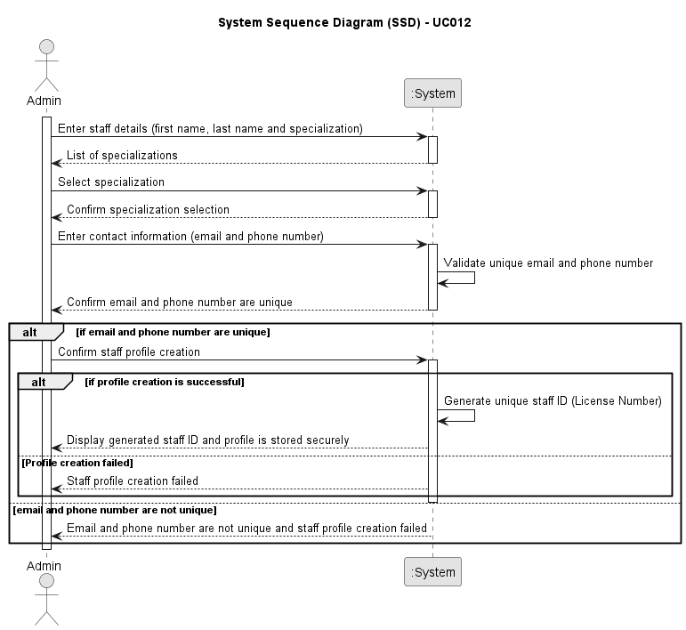

# UC012 - As an Admin, I want to create a new staff profile, so that I can add them to the hospital’s roster

## 1. Requirements Engineering

### 1.1. Use Case Description

> As an Admin, I want to create a new staff profile, so that I can add them to the hospital’s roster

---

### 1.2. Customer Specifications and Clarifications

**From the specifications document:**

- n/a

**From the client clarifications:**

> **Question:** I have one question related to the staff license number. Since it will be generated, would you like it to be generated in any particular format or algorithm of your choice?
>
> **Answer:** > There is a misinformation in the RFP. Staff IDs are unique and generated by the system. License numbers are unique but **not** generated by the system.  
> Staff IDs follow the format `"(N | D | O)yyyynnnnn"`.  
> For instance: `N202401234`  
> **N** is for nurse  
> **D** is for doctor  
> **O** is for other  
> **yyyy** is the year of recruitment  
> **nnnnn** is a sequential number
>
> **Question:** How should the specialization be assigned to a staff? Should the admin write it like a first name? Or should the admin select the specialization?
>
> **Answer:** the system has a list of specializations. staff is assigned a specialization from that list

---

### 1.3. Acceptance Criteria

> AC012.1: Admins can input staff details such as first name, last name, contact information, and specialization.
> AC012.2: A unique staff ID (License Number) is generated upon profile creation.
> AC012.3: The system ensures that the staff’s email and phone number are unique.
> AC012.4: The profile is stored securely, and access is based on role-based permissions.

---

### 1.4. Found out Dependencies

- This Use Case is relative to US 5.1.12, which is related to the create staff profile made by Admin.
- It relates to the following Use Cases as well:
n/a

### 1.5 Input and Output Data

**Input Data:**

- Automatic data:
  - First name
  - Last name
  - Contact information

- Selected data:
  - Specialization

**Output Data:**

- Staff profile created with success

### 1.6. System Sequence Diagram (SSD)

### 1.7 Other Relevant Remarks

n/a
