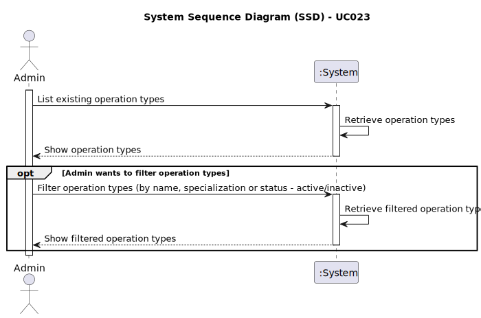

# UC023 - As an Admin, I want to list/search operation types, so that I can see the details, edit and remove operation types

## 1. Requirements Engineering

### 1.1. Use Case Description

> As Admin, I want to list/search existing operation types.
---

### 1.2. Customer Specifications and Clarifications

**From the specifications document:**

- Operation types are medical procedures that can be performed at the hospital.
- Admin must be able to add, edit, delete, and list/search operations.
- When listing existing operation types, the Admin must be able to see several details, such as:
  - Name
  - Required staff
  - Estimated duration
- The Admin must be able to filter operation types by:
  - Name
  - Specialization
  - Status (active/inactive)
- After listing operations types, the Admin must be able to view, edit or delete a selected one.

**From the client clarifications:**

N.A.

### 1.3. Acceptance Criteria

> AC023.1: Admins can search and filter operation types by name, specialization or status (active/inactive).
> AC023.2: The system displays operation types in a searchable list with attributes such as name, required staff and estimated duration.
> AC023.3: Admins can select an operation type to view, edit or deactivate it.

### 1.4. Found out Dependencies

- This Use Case is relative to US5.1.23, which is related to the operation types management functionality.
- It relates to the following Use Case(s) as well:
  - [UC020 (US5.1.20)](../UC020/README.md) - As an Admin, I want to add new types of operations, so that I can reflect the available medical procedures in the system.
  - [UC021 (US5.1.21)](../UC021/README.md) - As an Admin, I want to edit existing operation types, so that I can update or correct information about the procedure.
  - [UC022 (US5.1.22)](../UC022/README.md) - As an Admin, I want to remove obsolete or no longer performed operation types, so that the system stays current with hospital practices.

### 1.5 Input and Output Data

**Input Data:**

- Typed data: N.A.
- Selected data (filters):
  - Operation type name.
  - Specialization.
  - Status (active/inactive).

**Output Data:**

- Operation types list:
  - Name.
  - Required staff.
  - Estimated duration.

### 1.6. System Sequence Diagram (SSD)

### 1.7 Other Relevant Remarks

- N.A.
